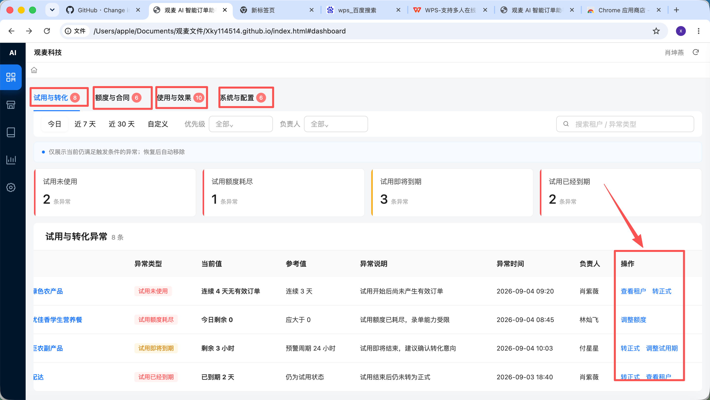
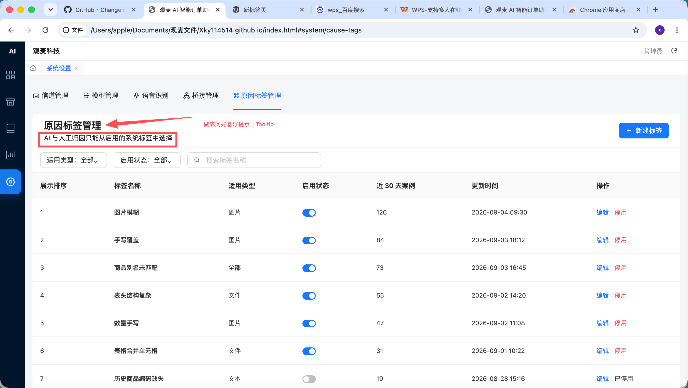
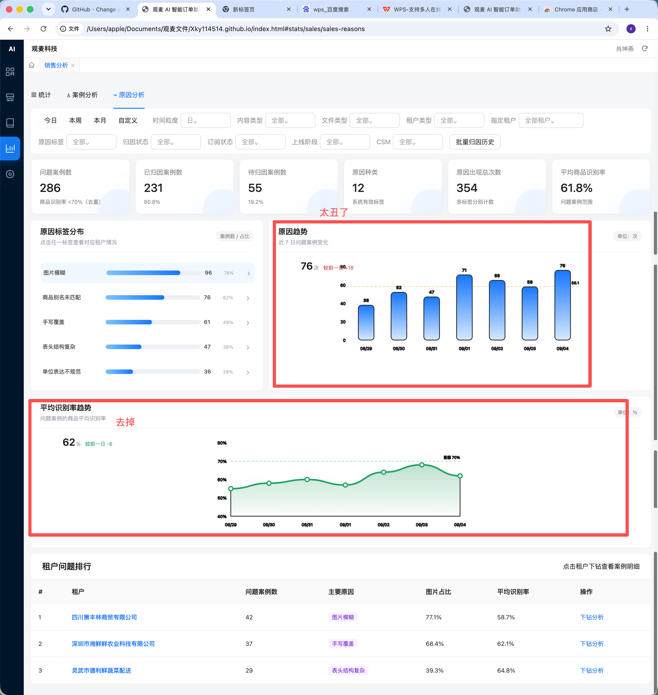

# 运营迭代需求文档

> 版本：V2.3；范围：仅覆盖原需求文档中的运营迭代内容；菜单、模块、页签及字段名称均以当前前端原型为准。

## 1. 产品目标

本次迭代用于帮助运营人员快速发现并处理租户问题，核心包括：

- 进入系统后优先查看本人需要处理的运营事项。
- 补充租户图片订单数据和低识别率问题案例。
- 支持人工原因标签、AI 自动归因及原因下钻。
- 集中处理试用转化、额度及合同履约、使用活跃与识别质量、系统运行与配置事项。

当前项目属于可交互前端原型，部分筛选、数据计算、保存和状态恢复仍使用演示数据；正式实现需接入真实业务数据和后端接口。

## 2. 页面与名称调整

| 模块 | 调整内容 |
|---|---|
| 运营工作台 | 独立为一级菜单并作为默认首页 |
| 运营工作台页签 | 试用转化、额度及合同履约、使用活跃与识别质量、系统运行与配置 |
| 销售业务分析 | 数据概览、问题案例、问题归因分析三个平级页签 |
| 采购业务分析 | 数据概览、问题案例、问题归因分析三个平级页签 |
| 原因标签管理 | 保留在系统设置中 |

> 图片为原始需求标注图，仅用于说明调整位置；页面名称以本文为准。

### 2.1 问号悬浮提示

- 字段或指标存在特殊口径时，在名称右侧显示问号。
- 悬浮、点击或键盘聚焦后展示含义、计算口径和限制。
- 页面不再长期展示大段解释文字，普通字段不增加问号。

## 3. 核心需求

### 3.1 租户级图片订单占比

#### 核心字段

| 字段 | 来源与计算 | 展示 |
|---|---|---|
| 租户名称 | 订单关联的租户主数据 | 点击打开租户运营分析 |
| 提交订单数 | 当前筛选范围内的有效订单数 | 整数 |
| 图片订单数 | 内容类型为图片的有效订单数 | 整数 |
| 图片订单占比 | 图片订单数 ÷ 提交订单数 × 100% | 保留 1 位小数 |
| 商品名称识别率 | 正确商品名称行数 ÷ 有效商品行数 × 100% | 保留 1 位小数 |
| 数量识别率 | 正确数量行数 ÷ 有效商品行数 × 100% | 保留 1 位小数 |
| 备注识别率 | 正确备注行数 ÷ 有效商品行数 × 100% | 保留 1 位小数 |

#### 关键规则

- 有效订单为提交成功、未删除、未作废且非测试数据的订单。
- 一笔订单包含多张图片时仍计为 1 个图片订单。
- 无有效订单时，图片订单数、图片订单占比和识别率均显示“—”。
- 图片订单占比放在备注识别率之前，支持升降序，空值始终置底。
- 导出增加图片订单数和图片订单占比，并继承当前筛选条件。
- 点击租户后展示文本、图片、文件订单数，三类识别率、原因标签分布和问题案例。

当前原型已完成字段展示、占比排序、导出入口和租户抽屉；正式版本需将演示数据替换为真实聚合结果，并让筛选条件对列表、导出和下钻同时生效。

### 3.2 问题案例：案例原始内容预览

#### 问题案例字段

| 字段 | 说明 |
|---|---|
| 任务提交时间 | 任务首次提交时间 |
| 租户名称 | 案例所属租户，可进入租户运营分析 |
| 来源群聊 / 下单客户 | 任务来源信息 |
| 内容类型 | 文本、图片、文件；点击打开预览 |
| 商品名称识别率、数量识别率 | 当前案例的字段识别结果 |
| 原因标签 | 当前有效原因标签，可多选 |
| 归因状态 | 待归因、归因中、已归因、归因失败 |
| 归因来源 | AI、人工或“—” |
| AI 置信度、归因依据 | AI 结果；人工归因时置信度显示“—” |
| 操作 | 预览、调整标签、重新归因、查看详情 |

#### 预览交互

| 内容类型 | 展示与操作 |
|---|---|
| 文本 | 展示原始文字，支持复制 |
| 图片 | 支持多图切换、放大和缩小 |
| 文件 | 展示文件名、格式、大小、原始文件入口及可读取内容 |

- 抽屉同时展示案例编号、租户、AI 原始识别结果和人工最终确认结果。
- 加载失败时展示原因和重新加载入口；无权限时不返回原始内容。
- 关闭抽屉后保留问题案例列表的筛选和位置。

当前原型已完成三种内容的预览样式、图片缩放和失败状态；复制、真实图片切换、原始文件及详情仍需接入实际能力。

### 3.3 人工原因标签与原因标签管理

#### 人工调整原因标签

- 支持搜索、多选、增加和删除原因标签。
- 只能选择已启用且适用于当前内容类型的系统标签，不能在问题案例中临时新建标签。
- 保存后归因来源更新为“人工”，后续 AI 不得覆盖。
- 删除全部标签后，归因状态恢复为“待归因”。
- 保存操作记录调整前后标签、操作人、操作时间和调整说明。

#### 原因标签管理字段

| 字段 | 规则 |
|---|---|
| 展示顺序 | 1～999，数值越小越靠前 |
| 原因标签名称 | 2～30 个字符，同一适用范围内不可重复 |
| 适用内容类型 | 全部、文本、图片、文件 |
| 启用状态 | 停用后不参与新归因，历史案例继续展示 |
| 近 30 天关联案例数 | 最近 30 天使用该标签的去重案例数 |
| 更新时间 | 最近一次修改时间 |
| 操作 | 编辑、停用或启用 |

“AI 与人工归因只能选择已启用系统标签”的说明改为标题旁的问号提示。已被案例使用的标签不得物理删除。

当前原型已完成人工标签搜索、多选和页面内保存；原因标签管理的新建、编辑、筛选和启停仍需接入保存逻辑。

### 3.4 AI 自动归因

#### 触发条件

- 任务处理完成，商品名称识别率低于 70%。
- 案例没有人工锁定的归因结果。
- 同一案例当前没有正在执行的归因任务。

#### 输入与输出

| 类型 | 核心内容 |
|---|---|
| 输入 | 原始内容、AI 原始结果、人工最终结果、字段修改差异、内容类型、租户信息、可用标签 |
| 输出 | 推荐标签、置信度、归因依据、归因状态、归因时间、模型版本和任务标识 |

- AI 只能选择已启用的系统标签，不得创建新标签。
- 归因异步执行，不影响订单提交。
- 无法确定原因时保持待归因；失败时支持重新归因。
- 人工结果优先，同一案例不得并发执行多个归因任务。
- 历史批量归因需展示总数、成功数、失败数和执行进度。

当前原型已展示四种归因状态和失败重试；真实 AI 调用、任务进度、错误信息和结果回写仍需后端支持。

### 3.5 问题归因分析

#### 汇总指标

| 指标 | 计算逻辑 |
|---|---|
| 问题案例数 | 商品名称识别率低于 70% 的去重案例数 |
| 已归因案例数 | 至少存在 1 个有效原因标签的去重案例数 |
| 待归因案例数 | 尚无有效标签的案例数，包含待归因、归因中和归因失败 |
| 原因种类 | 当前范围内出现过的不同原因标签数 |
| 原因出现总次数 | 所有有效标签关系数，一例多标签分别计数 |
| 平均商品识别率 | 正确商品名称行数之和 ÷ 有效商品行数之和 × 100% |

已归因率和待归因率均以问题案例数为分母；分母为 0 时显示“—”。平均商品识别率采用加权计算。

#### 图表与下钻

| 内容 | 展示与交互 |
|---|---|
| 原因标签分布 | 展示原因出现次数、关联问题案例数和占比；占比 = 当前原因出现次数 ÷ 原因出现总次数 |
| 原因趋势 | 按日、周、月展示当前原因的出现次数变化，使用平滑折线和浅色面积填充 |
| 租户问题排行 | 展示租户名称、问题案例数、高频原因、图片类案例占比、平均商品识别率和操作 |

- 点击原因标签后打开关联租户分析，展示租户名称、问题案例数、主要内容类型、平均商品识别率和近期问题概述。
- 点击租户进入租户运营分析，再查看对应问题案例；筛选条件需全链路保留。
- 移除独立的平均识别率趋势图，平均商品识别率只保留在汇总指标和租户明细中。

当前原型已完成平滑趋势、原因标签点击、关联租户分析和租户下钻；正式版本需统一筛选、图表、汇总和明细的计算口径。

### 3.6 试用转化

| 事项类型 | 当前原型紧急程度 | 触发条件 | 操作 |
|---|---|---|---|
| 试用期无有效使用 | 高 | 试用期间连续超过 3 天无有效订单 | 查看租户详情、转为正式租户 |
| 试用额度已耗尽 | 高 | 可用试用额度 ≤ 0 | 调整租户额度 |
| 试用即将到期 | 中 | 剩余时间进入预警周期 | 转为正式租户、延长试用期 |
| 试用已到期 | 高 | 已超过试用结束时间且仍为试用状态 | 转为正式租户、查看租户详情 |

关键字段包括订阅状态、试用开始与结束时间、剩余试用时间、最近使用时间、今日已用额度、可用额度和客户成功经理。

- 剩余试用时间 = `最大值（试用结束时间 - 当前时间，0）`。
- 可用额度 = 试用额度总量 - 累计已用额度。
- 转为正式租户需填写生效日期、合同方案、初始额度、当前处理人和处理备注。
- 调整租户额度和延长试用期成功后重新检测相关事项。

### 3.7 额度及合同履约

| 事项类型 | 当前原型紧急程度 | 触发条件 | 操作 |
|---|---|---|---|
| 可用额度不足 | 高 | 使用率 ≥ 80%、可用比例 < 20%，或低于固定阈值 | 调整租户额度、查看租户详情 |
| 可用额度已耗尽 | 高 | 可用额度 ≤ 0 | 调整租户额度 |
| 合同即将到期 | 中 | 进入到期提醒周期且没有有效续签合同 | 查看合同详情 |
| 合同回款逾期 | 低 | 应收日期已过且仍有待收金额 | 查看合同详情 |
| 合同已到期 | 高 | 合同结束且未完成续签 | 查看合同详情 |
| 预计可用额度不足 | 高 | 预计可用天数小于合同剩余天数 | 调整租户额度 |

核心公式：

- 可用额度 = 额度总量 - 已用额度。
- 额度使用率 = 已用额度 ÷ 额度总量 × 100%。
- 近 7 日日均用量 = 最近 7 个自然日额度扣减总量 ÷ 7。
- 预计可用天数 = 可用额度 ÷ 近 7 日日均用量；日均为 0 时显示“—”且不触发。
- 待收金额以应收计划中尚未核销的余额为准，退款影响方式需按财务口径确认。

调整租户额度需记录调整方式、额度值、生效时间、原因和前后值；查看合同详情可继续进入合同管理。

### 3.8 使用活跃与识别质量

| 事项类型 | 当前原型紧急程度 | 核心触发条件 |
|---|---|---|
| 商品名称识别率低 | 中 | 有效样本达到门槛且识别率 < 70% |
| 商品识别率显著下降 | 中 | 较上一周期下降超过设定百分点 |
| 任务提交成功率低 | 中 | 成功提交任务数 ÷ 有效任务数低于阈值 |
| 失败任务数异常增长 | 中 | 当前失败数明显高于对比周期 |
| 订单量异常下降 | 低 | 最近 7 日订单量低于前 7 日的 50% |
| 订单量连续下降 | 低 | 连续多日逐日下降 |
| 调用量异常增长 | 中 | 当日调用量超过近 7 日均值 3 倍 |
| 长时间无有效订单 | 中 | 正式租户连续多日无有效订单 |
| 已签约未上线 | 中 | 签约或确认收款后超过上线周期仍未上线 |
| 群聊活跃率低 | 低 | 近 30 日活跃群聊占比低于阈值 |

核心公式：

- 商品名称识别率 = 正确商品名称行数 ÷ 有效商品行数 × 100%。
- 任务提交成功率 = 成功提交任务数 ÷ 有效任务数 × 100%。
- 群聊活跃率 = 近 30 日产生有效任务的群聊数 ÷ 已绑定且启用的群聊数 × 100%。

工作台仍使用通用列表字段，具体指标组合展示在当前检测结果、触发条件或事项详情中。操作包括查看运营分析、查看问题案例、查看租户详情和查看群聊详情。

### 3.9 系统运行与配置

| 事项类型 | 当前原型紧急程度 | 触发条件 | 操作 |
|---|---|---|---|
| 接入信道离线 | 高 | 已启用信道连续无有效心跳或状态离线 | 配置信道 |
| 关键群聊已静音 | 高 | 关键群聊停止接收消息 | 查看群聊详情 |
| 数据同步失败 | 高 | 最近一次同步任务失败 | 查看错误详情、重新同步 |
| 数据长时间未同步 | 高 | 超过规定时间没有成功同步 | 立即同步 |
| 对接配置缺失 | 高 | 必填配置为空或凭证校验失败 | 完善对接配置 |
| 异常通知未配置 | 低 | 无有效通知群、通知群静音或通知关闭 | 配置异常通知 |

事项详情根据类型展示信道状态与最近心跳、同步错误与最近成功时间、对接平台配置或通知配置。保存或重新同步后需校验结果并重新检测事项。

当前原型已展示操作抽屉和主要静态字段；信道操作可进入接入信道管理，其他配置和同步操作仍需接入真实保存及执行结果。

## 4. 运营工作台通用规则

### 4.1 列表字段

| 字段 | 说明 |
|---|---|
| 紧急程度 | 高、中、低；列表行仅显示红、橙、蓝圆点 |
| 租户名称 | 事项所属租户，可打开租户详情 |
| 事项类型 | 当前检测到的问题类型 |
| 当前检测结果 | 当前额度、识别率、订单量或系统状态 |
| 触发条件 | 上期值、历史均值、规则阈值或状态要求 |
| 最近触发时间 | 最近一次满足触发条件的时间 |
| 当前处理人 | 当前承担处理责任的人员 |
| 处理状态 | 待处理、处理中、已完成 |
| 操作 | 业务操作及开始处理、标记完成、重新打开 |

列表移除“问题描述”和“处理时限”。详细背景、影响范围、完整规则和处理记录放入事项详情抽屉。

### 4.2 展示与处理

- 默认展示我的待办；可切换全部待办和处理记录。
- 支持时间、紧急程度、租户名称和事项类型筛选。
- 默认按紧急程度、处理状态、最近触发时间排序。
- 筛选器保留高、中、低文字，只有列表紧急程度列隐藏文字。
- 待处理可开始处理，处理中可标记完成，已完成可重新打开。
- 异常条件消失后自动移出当前列表，并在处理记录中保留恢复记录。

### 4.3 同一租户多事项

- 同一租户、同一事项类型只显示一条；重复检测只更新当前值、触发时间和次数。
- 不同事项类型分别展示，租户名称旁提示其他未完成事项数量。
- 租户整体紧急程度取全部未完成事项中的最高等级。
- 系统运行问题造成其他指标异常时，标记根因事项和关联事项，优先处理根因。

### 4.4 操作交互

- 查看类操作打开右侧抽屉；调整和配置类操作使用抽屉或弹窗。
- 同一行最多直接展示 3 个操作，其余收纳到“更多”。
- 高风险操作二次确认；提交中禁用按钮，失败时保留已填写内容。
- 成功后刷新当前行、概览数据、页签数量和处理记录。
- 无权限的操作不展示；状态变化和业务调整均记录操作人、时间、结果及前后值。

## 5. 验收要点

- 登录后默认进入运营工作台并展示我的待办，四个页签名称与当前系统一致。
- 工作台列表不再展示问题描述和处理时限，紧急程度列只显示颜色圆点。
- 图片订单占比、识别率和原因分析指标能够按本文公式复算。
- 原始内容支持文本、图片和文件预览，失败及无权限状态明确。
- 人工原因标签不被 AI 覆盖，归因失败可以重新执行。
- 原因标签能够下钻至关联租户和对应问题案例。
- 问题归因分析不再展示独立的平均识别率趋势图。
- 各操作具备打开内容、字段校验、提交状态、成功或失败反馈。
- 同一租户、同一事项类型不产生重复行，异常恢复和关键操作可追溯。
