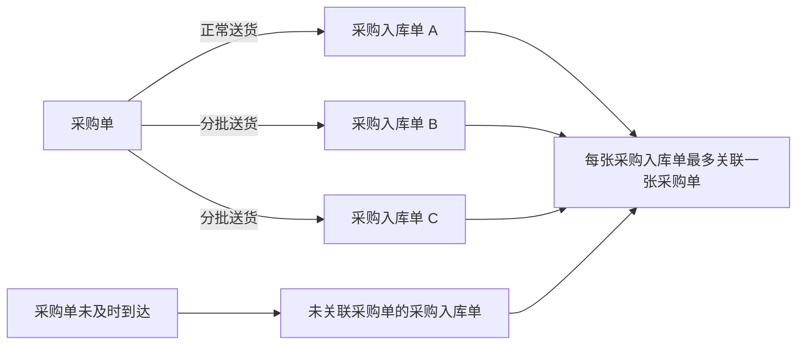
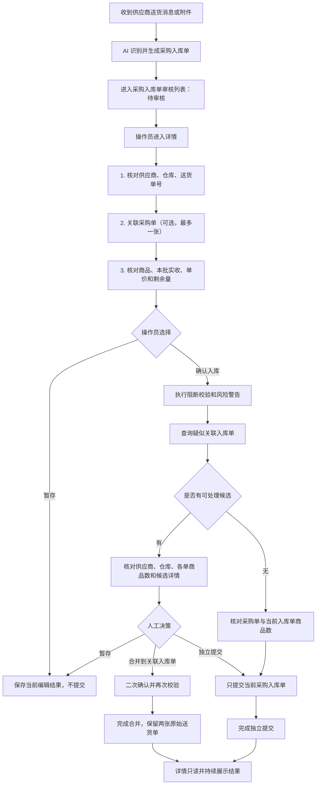
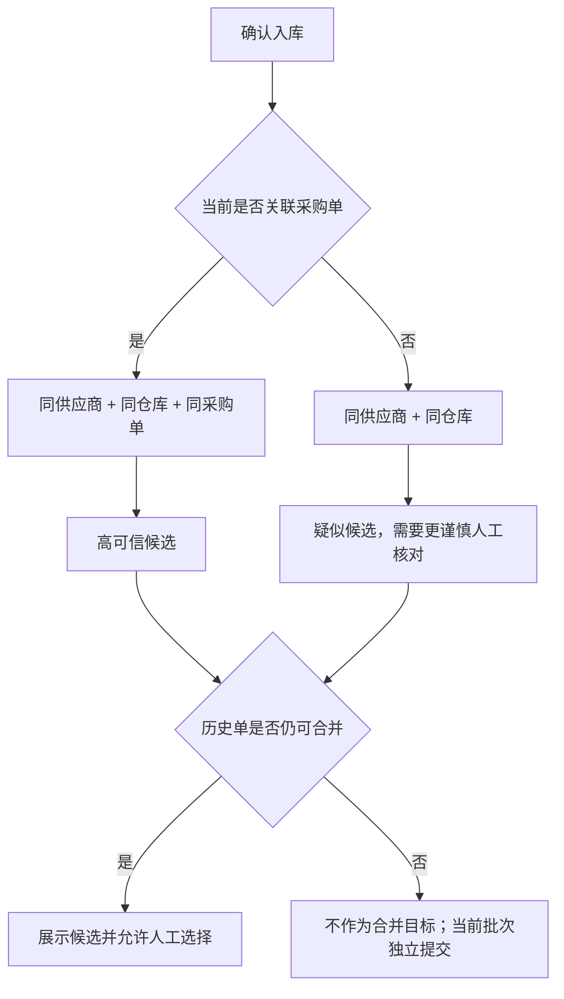

# 采购单与采购入库单优化 PRD（正常送货 / 分批送货）

文档版本：V0.2

更新时间：2026-07-11

适用范围：采购单录入与审核、采购入库单录入与审核、采购入库单详情、确认入库弹窗、关联采购入库单核对。
评审对象：业务负责人、产品、前端、后端、测试。

## 一、需求一句话说明

本期只把“正常一单一入库”和“一张采购单分多批送货、对应多张采购入库单”两条链路做完整；采购入库单可暂不关联采购单，但每张采购入库单最多只能关联一张采购单，确认时由操作员人工决定独立提交、暂存，或合并到一张符合条件的历史关联入库单。

### 建议评审讲解顺序

1. 先讲第三章范围边界，明确本期做什么、不做什么。
2. 再讲第四章单据关系，统一“一张采购单对应一张或多张采购入库单”。
3. 按第六章走一遍操作员端到端链路。
4. 用第十一、十二章解释确认弹窗、候选匹配和人工决策。
5. 用第十三章确定哪些异常阻断、哪些只警告。
6. 用第八至十章对齐页面字段、编辑权限和计算口径。
7. 用第十六、十七章与后端确认接口、幂等和并发。
8. 最后按第十八章验收场景逐条确认测试范围。

## 二、背景与目标

### 2.1 业务背景

供应商可能一次送完，也可能按天或按批次送货。第一批送货对应的采购入库单可以先确认，后续批次到达时，系统需要提醒操作员是否存在可继续合并的历史入库单，避免重复创建或误合并。

外部送货材料通常只有本批送货数量、单价和金额，不包含采购订单原订购量，也无法可靠说明每一行商品属于哪一张采购单。因此本期不支持一张采购入库单关联多张采购单。

### 2.2 本期目标

1. 正常一张采购单对应一张采购入库单可以直接完成审核和确认。
2. 一张采购单对应多张采购入库单时，系统能识别历史批次并给出清晰的人工决策入口。
3. 采购单未及时到达时，采购入库单可以不关联采购单，仍按供应商和仓库识别疑似历史批次。
4. 确认入库只处理当前送货单，不自动提交其它暂存或待审核单据。
5. 操作员能在提交前看清采购单、当前入库单和疑似关联入库单的商品数，并查看候选明细。
6. 已确认记录只读，提交结果持续展示，避免重复操作。
7. 页面、流程图、字段、校验规则和接口口径保持一致，可直接用于研发评审和测试验收。

## 三、范围边界

### 3.1 本期包含

| 场景 | 单据关系 | 处理结果 |
|---|---|---|
| 正常送货 | 1 张采购单 → 1 张采购入库单 | 核对商品数后独立提交 |
| 关联采购单的分批送货 | 1 张采购单 → 多张采购入库单 | 检测同采购单、同仓库历史批次，人工选择合并或独立提交 |
| 未关联采购单的分批送货 | 无采购单 → 当前采购入库单 | 检测同供应商、同仓库历史批次，人工核对后选择 |
| 历史批次已完成 | 1 张采购单 → 已完成历史批次 + 当前批次 | 历史记录不再合并，当前批次独立提交 |
| 暂存 | 当前采购入库单 | 保存当前编辑结果，不提交、不联动其它单据 |
| 已确认查看 | 已确认采购入库单 | 关联关系、商品明细和操作结果只读 |

### 3.2 本期不包含

| 非本期场景 | 不做原因 | 页面约束 |
|---|---|---|
| 多张采购单合并送货，对应一张采购入库单 | 外部送货材料缺少逐行采购单归属和原订购量 | 采购单控件保持单选，最多一张 |
| 合并送货与分批送货混合 | 会形成多对多关系，累计和差异口径不稳定 | 不展示混合模式入口 |
| 系统自动逐商品差异判断 | 商品别名、单位换算和拆行逻辑复杂 | 本期只展示商品数和数量汇总，最终人工确认 |
| 自动合并 | 同供应商不等于同一批业务 | 系统只提示候选，不自动执行 |
| 退入库、采购退货或红冲 | 本需求未提出此类业务 | 不新增入口、状态和流程 |

## 四、核心名词与关系

| 名词 | 定义 | 本期关系约束 |
|---|---|---|
| 采购单 | 记录计划采购商品、数量和供应商的业务单据 | 1 张采购单可关联 0～多张采购入库单 |
| 采购入库单 | 记录某一次实际送货、收货和确认结果的业务单据 | 1 张采购入库单可关联 0～1 张采购单 |
| 当前采购入库单 | 操作员正在审核的本批送货记录 | 本次提交只处理这一张 |
| 关联采购入库单 | 系统检测到、可能和当前批次属于同一业务的历史入库单 | 必须人工核对，不自动合并 |
| 合并到关联入库单 | 把当前分批送货记录并入一张仍可合并的历史入库单 | 两张原始送货单和各自明细继续保留 |
| 合并送货 | 一张入库单同时关联多张采购单 | 与上一个概念不同，本期不支持 |
| 商品数 | 单据商品明细行数 | 不等于数量合计，不代表已完成逐商品差异判断 |



## 五、角色与系统职责

| 角色 / 系统 | 主要职责 | 不负责内容 |
|---|---|---|
| 供应商 / 外部送货材料 | 提供本批商品、数量、单价、金额和送货信息 | 不保证提供采购单号和原订购量 |
| AI 录单系统 | 识别送货信息，生成采购入库单待审核任务 | 不自动判定是否应合并 |
| 操作员 | 核对供应商、仓库、送货单、采购单关联、商品和数量，并作最终选择 | 不需要在确认弹窗关注外部审核状态 |
| 后端服务 | 保存草稿、校验幂等、查询候选、提交或合并、记录操作日志 | 不能只依赖前端校验 |
| 外部系统 | 接收入库数据并维护后续审核状态 | 外部审核状态不在确认弹窗展示 |

## 六、端到端业务链路



## 七、状态模型

### 7.1 采购入库单本地状态

| 状态 | 进入条件 | 允许操作 | 禁止操作 |
|---|---|---|---|
| 待审核 | AI 识别后生成任务 | 编辑、关联/取消采购单、暂存、确认入库 | 无 |
| 暂存 | 操作员主动暂存 | 继续编辑、修改采购单关联、再次确认 | 不自动提交 |
| 已确认入库 | 独立提交或合并成功 | 查看来源、关联关系、明细和结果 | 重识别、删除、编辑、暂存、重复确认 |
| 同步失败 | 提交请求失败或结果不确定 | 查看失败原因、人工重试（后续接口能力） | 自动重复提交 |

### 7.2 采购单关联状态

| 状态 | 推导条件 | 对当前采购入库单的影响 |
|---|---|---|
| 未关联 | 采购单没有关联入库记录 | 可被同供应商的采购入库单选择 |
| 已关联未确认 | 至少有一张关联入库单为待审核或暂存，且没有已确认记录 | 各批次独立审核，不自动联动 |
| 已有入库确认 | 至少有一张关联入库单已确认 | 允许继续关联后续分批送货 |
| 已关闭不可再关联 | 采购单已关闭 | 禁止新增关联和确认入库 |

### 7.3 候选资格所需内部状态

外部同步和审核状态只供系统筛选候选，不在确认弹窗和候选详情中展示。只有满足以下条件的历史入库单才可作为合并目标：

1. 历史入库单已成功同步。
2. 历史入库单仍处于外部待审核阶段。
3. 与当前单供应商、仓库一致。
4. 双方都关联采购单时，采购单必须相同。
5. 候选当前仍可查看且未发生状态变化。

## 八、采购入库单审核列表字段

| 页面字段 | 业务含义 | 来源 / 计算 | 展示与交互规则 | 异常处理 |
|---|---|---|---|---|
| 本地状态 | 当前采购入库单处理进度 | `purchaseTasks.status` | 使用待审核、暂存、已确认入库等业务状态 | 已确认行只读 |
| 送货情况 | 帮助操作员快速识别业务场景 | `purchaseTasks.scenario` | 使用正常送货、同采购单历史批次、同供应商疑似批次、前批已完成等口径 | 不展示强匹配/弱匹配技术词 |
| 时间 | 任务创建或进入审核列表时间 | 建议 `createdAt` | 用于排队和追溯 | 接口为空显示“-” |
| 群聊 | 原始消息来源群 | `group` | 可按群筛选 | 无权限群只展示脱敏名称 |
| 供应商 | 实际送货供应商 | `supplier` | 影响采购单筛选和候选匹配 | 为空时确认阻断 |
| 原文 | AI 识别前的消息或送货摘要 | `raw` | 永久保留，不被人工修正覆盖 | 仅查看 |
| 商品数 | AI 识别出的商品明细行数 | `detailItems.length` | 显示“X 个商品” | 不做数量合计 |
| 关联采购单 | 当前唯一采购单 | `linkedPurchaseOrderIds[0]` | 可为空；最多一张 | 多值视为数据异常并阻断 |
| 采购单关联状态 | 采购单下入库关联进度 | `getPurchaseOrderFlowStatus()` | 只提示，不替代当前单状态 | 已关闭时确认阻断 |
| 提交提示 | 本次确认可能产生的结果 | `inboundConfirmImpactText()` | 正常提交、发现疑似历史批次、前批已完成等 | 不在列表直接执行提交 |
| 操作员 | 当前负责人 | `auditor` / `operator` | 待审核和暂存可调整；已确认只读 | 变更需记录日志 |
| 操作 | 进入后续处理 | 前端权限计算 | 待审核：查看、重识别、删除；已确认：仅查看 | 删除需二次确认和权限校验 |

## 九、采购入库单详情字段

### 9.1 顶部与来源信息

| 字段 | 含义 | 来源 | 可编辑性 | 校验 / 异常 |
|---|---|---|---|---|
| 供应商 | 实际送货供应商 | `supplier` | 确认前可改，确认后只读 | 修改后自动解除供应商不一致的采购单关联 |
| 操作员 | 当前处理人 | `auditor` | 列表可调整，详情展示 | 已确认后只读 |
| 来源群聊 | 送货消息来源 | `group` | 只读 | 用于追溯 |
| 仓库 | 实际收货仓库 | `warehouse` | 本期详情展示 | 为空时确认阻断 |
| 送货单号 | 供应商送货凭证号 | `deliveryNo` | 本期详情展示 | 同供应商重复时确认阻断 |
| 原始文件 | 图片、PDF 或其它附件 | 附件服务 | 只读 / 下载 | 需校验权限和有效期 |
| 原始消息 | AI 识别前文本 | `raw` | 只读 | 不允许被修正字段覆盖 |
| 三步操作指引 | 核对送货信息 → 关联采购单 → 核对商品并提交 | 前端固定文案 | 只读 | 已确认详情不再展示操作步骤 |
| 提交结果 | 独立提交或合并结果 | `mergedIntoInboundId` 等 | 只读 | 持续展示，不依赖短时 toast |

### 9.2 关联采购单区

| 字段 / 操作 | 规则 | 界面口径 |
|---|---|---|
| 关联采购单 | 可选，最多选择一张 | 未关联也允许确认入库 |
| 可选采购单范围 | 同供应商、未关闭、处于可关联状态 | 采购单来源可以是外部系统录入或 AI 回传 |
| 已选采购单 | 再次点击可取消 | 已确认后显示“已关联”，控件禁用 |
| 采购单关联状态 | 由采购单关闭状态和历史入库记录推导 | 用于判断是否可能存在分批送货 |
| 查看关联采购入库单 | 展示该采购单下其它批次 | 不自动联动提交 |
| 采购单详情 | 展示采购商品和计划数量 | 只读核对 |
| 未关联只读态 | 已确认时不再展示其它可选采购单 | 明确显示“本次确认入库未关联采购单” |

### 9.3 商品明细字段

| 页面字段 | 业务含义 | 来源 / 计算 | 可编辑性 | 校验 / 异常 |
|---|---|---|---|---|
| 序号 | 商品行顺序 | 前端生成 | 只读 | 无 |
| 识别文本 | AI 切分出的商品原文 | `detailItems.raw` | 只读 | 用于审核证据 |
| 商品名称 | 人工确认后的标准名称 | `detailItems.name` | 确认前可改 | 为空阻断；修改后重新计算采购单商品匹配 |
| 采购数 | 唯一关联采购单的计划数量 | `order.items[].qty` | 只读 | 未关联显示“-” |
| 历史已确认 | 同采购单其它已确认批次累计实收 | 按商品名 + 单位聚合 | 只读 | 不跨单位换算 |
| 本批实收 | 当前批次最终收货数量 | `detailItems.receivedQty` | 确认前可改 | 必须为有效数字且大于 0 |
| 确认后剩余 | 采购数 - 历史已确认 - 本批实收 | 前端提示 / 后端校验 | 只读 | 负数表示累计超收并警告 |
| 识别到货数/单位 | AI 识别出的原始数量文本 | `detailItems.qty` | 只读 | 不作为最终入库数量，避免和本批实收混淆 |
| 单价 | 当前入库单价 | `detailItems.price` | 确认前可改 | 无效或小于等于 0 时警告 |
| 金额 | 计算数量 × 单价 | `formatInboundAmount()` | 只读 | 正式业务以后端金额为准 |
| 备注 | 短缺、破损、复称等说明 | `detailItems.remark` | 确认前可改 | 修改后立即写回草稿 |
| SPU 名称 | 商品主数据匹配结果 | `detailItems.spu` | 本期只读 | 未匹配需人工处理 |
| 商品编码 | 商品主数据编码 | `detailItems.code` | 本期只读 | 未匹配需人工处理 |

## 十、数量与金额口径

### 10.1 汇总字段

| 字段 | 公式 | 展示规则 | 是否驱动提交 |
|---|---|---|---|
| 采购单原订购 | `sum(关联采购单商品采购数)` | 未关联显示“未关联” | 否，只作参考 |
| 历史已确认 | `sum(同采购单其它已确认批次实收数)` | 未关联显示“-” | 用于超收提示 |
| 本批实收 | `sum(detailItems.receivedQty)` | 修改实收时实时刷新 | 是，必须有效 |
| 确认后剩余 | `采购单原订购 - 历史已确认 - 本批实收` | 负数红色提示 | 否，负数警告但不自动阻断 |

不同计量单位不能直接合计。正式接口应按商品与单位返回聚合结果，或直接返回后端计算好的展示值。当前原型的总数只用于页面提示。

### 10.2 金额计算优先级

| 配置 | 公式 | 适用说明 |
|---|---|---|
| 实收数优先 | `本批实收 × 单价` | 默认，按实际收货金额入库 |
| 采购数优先 | `采购数 × 单价` | 仅在业务明确要求时启用 |
| 取两者最小值 | `min(采购数, 本批实收) × 单价` | 避免金额超过采购计划 |

正式提交金额必须由后端再次计算或校验，前端计算仅用于即时反馈。

## 十一、确认入库弹窗口径

### 11.1 通用原则

1. 不显示当前采购入库单号。
2. 不显示采购单提交状态。
3. 不显示外部审核状态。
4. 商品数按明细行统计，不展示复杂逐商品差异结论。
5. 暂存、取消不会改变历史入库单。

### 11.2 各场景展示

| 场景 | 必须展示 | 操作按钮 | 结果 |
|---|---|---|---|
| 正常一单一入库 | 采购单商品数、当前入库单商品数 | 取消、暂存、确认提交 | 独立提交当前单 |
| 正常送货但未关联采购单 | 当前入库单商品数 | 取消、暂存、确认提交 | 独立提交当前单 |
| 有疑似关联入库单 | 供应商、仓库、采购单商品数（如有）、当前单商品数、候选数量、各候选商品数 | 查看详情、合并到此单、独立提交、暂存、取消 | 人工选择 |
| 合并二次确认 | 采购单商品数（如有）、当前单商品数、目标单商品数、合并后商品数、供应商、仓库 | 返回核对、确认合并 | 再校验后合并 |
| 历史批次已完成 | 采购单商品数、当前入库单商品数、“本批需独立提交”说明 | 取消、暂存、确认提交 | 历史不变，当前单独立提交 |

### 11.3 候选详情

候选详情只读展示供应商、仓库、送货日期、原始送货信息、商品名称、实收数量、单价、金额和备注。查看详情不会修改历史数据，返回后继续当前确认决策。

## 十二、候选匹配与合并规则



规则说明：

1. 同采购单匹配比仅同供应商匹配可信度高，但两种情况都必须人工确认。
2. 仓库必须一致，避免同供应商向不同仓库送货被误合并。
3. 双方都有采购单且采购单不同，不生成候选。
4. 系统按目标入库单去重，避免同一外部入库记录重复出现。
5. 点击“合并到此单”不立即执行，必须进入二次确认。
6. 最终合并前再次查询目标状态；状态变化则阻止操作并要求刷新。
7. 合并成功后，当前单与目标单的原始送货材料、商品明细和操作记录都必须保留。

## 十三、确认前校验矩阵

| 校验项 | 条件 | 级别 | 页面行为 | 后端要求 |
|---|---|---|---|---|
| 供应商 | 为空 | 阻断 | toast 提示并留在详情 | 必须再次校验 |
| 仓库 | 为空 | 阻断 | toast 提示并留在详情 | 必须再次校验 |
| 商品明细 | 0 行 | 阻断 | 不打开确认弹窗 | 必须再次校验 |
| 商品名称 | 任一行为空 | 阻断 | 提示补全 | 必须再次校验 |
| 单位 | 任一行为空 | 阻断 | 提示补全 | 必须再次校验 |
| 本批实收 | 非数字或小于等于 0 | 阻断 | 提示“实收数量必须大于 0” | 必须再次校验 |
| 重复送货单 | 同供应商下送货单号重复 | 阻断 | 提示重复单号 | 建唯一/幂等校验 |
| 采购单供应商 | 与当前单供应商不一致 | 阻断 | 要求解除或更换 | 必须再次校验 |
| 采购单状态 | 已关闭 | 阻断 | 不允许确认 | 提交事务内校验 |
| 商品未匹配采购单 | 同名同单位商品不存在 | 警告 | 确认弹窗列出风险 | 记录人工确认结果 |
| 累计超收 | 某商品确认后剩余小于 0 | 警告 | 按商品行提示 | 建议后端返回明细 |
| 单价 | 非数字或小于等于 0 | 警告 | 操作员决定是否继续 | 后端按业务配置处理 |
| 候选状态变化 | 二次确认时目标失效 | 阻断 | 返回候选选择并提示刷新 | 必须加并发控制 |
| 重复点击提交 | 同一请求重复到达 | 阻断重复处理 | 按钮防抖，显示已有结果 | 使用幂等键 |

## 十四、字段写回与只读规则

| 操作 | 写回字段 | 页面联动 |
|---|---|---|
| 修改供应商 | `task.supplier` | 自动解除供应商不一致的采购单关联并刷新候选范围 |
| 修改商品名称 | `detailItems[].name` | 重新计算采购单商品匹配、历史数量和剩余量 |
| 修改本批实收 | `detailItems[].receivedQty` | 实时刷新行金额、本批实收和确认后剩余 |
| 修改单价 | `detailItems[].price` | 实时刷新行金额 |
| 修改备注 | `detailItems[].remark` | 立即写回当前草稿 |
| 修改识别到货数 | 不允许 | 该字段保留为只读识别证据 |
| 已确认后修改任意业务字段 | 不允许 | 全部输入、采购单选择和新增删除入口禁用或隐藏 |

## 十五、操作权限与审计

1. 查看候选详情前校验数据权限，无权限时只提示存在记录，不泄露明细。
2. 重识别、删除、暂存、确认、独立提交、合并都应记录操作人、时间、当前单、目标单和结果。
3. 已确认入库单不提供重识别和删除入口。
4. 删除未确认任务需要二次确认；真实环境不得只在前端删除。
5. 合并操作至少记录 `currentInboundId`、`targetInboundId`、`purchaseOrderId`、幂等键和操作原因。

## 十六、建议接口契约

### 16.1 采购入库单详情

```json
{
  "id": "PI-20260701-014",
  "status": "待审核",
  "supplierId": "SUP-001",
  "supplierName": "春田蔬菜基地",
  "warehouseId": "WH-001",
  "warehouseName": "一号冷库",
  "deliveryNo": "DN-CT-0701-B2",
  "linkedPurchaseOrderId": "GM-PO-7712",
  "items": [
    {
      "lineId": "LINE-1",
      "rawText": "云南生菜 180 斤",
      "productName": "云南生菜",
      "unit": "斤",
      "recognizedQtyText": "180 斤",
      "receivedQty": 180,
      "price": 3.2,
      "remark": "第二批到仓"
    }
  ],
  "version": 3
}
```

### 16.2 确认前检查

请求建议包含：当前入库单 ID、数据版本、采购单 ID（可空）、供应商、仓库、送货单号和明细摘要。

响应建议包含：阻断错误、风险警告、采购单商品数、当前单商品数、候选列表、每个候选商品数和候选令牌。

### 16.3 最终提交

```json
{
  "inboundId": "PI-20260701-014",
  "action": "MERGE",
  "targetInboundId": "PI-20260701-012",
  "candidateToken": "candidate-token",
  "dataVersion": 3,
  "idempotencyKey": "uuid",
  "warningConfirmed": true
}
```

`action` 建议取值：`SUBMIT_NEW`、`MERGE`、`SAVE_DRAFT`。后端必须在同一事务中重新校验当前状态、采购单状态、目标状态和幂等键。

## 十七、异常与并发处理

1. 确认弹窗打开后采购单被关闭：最终提交阻断，并返回详情要求更换或解除。
2. 候选在二次确认前已被其它人完成审核：合并阻断，刷新候选后可改为独立提交。
3. 网络超时但后端已成功：按幂等键查询结果，不重复创建入库记录。
4. 同一送货单被两名操作员同时处理：后提交者收到版本冲突并查看最新只读结果。
5. 候选无查看权限：只提示“存在疑似记录”，不展示商品、金额等敏感信息。
6. 单位不一致：不跨单位累计，不自动换算，提示人工核对。
7. 商品名称变更后无法匹配采购单：重新计算并给出未匹配警告。
8. 外部同步失败：保留当前单、提交参数和错误原因，后续重试必须复用幂等键。

## 十八、验收场景

| 编号 | 前置条件 | 操作 | 预期结果 |
|---|---|---|---|
| AC-01 | 采购单无历史入库 | 确认当前入库单 | 弹窗展示采购单和当前单商品数，独立提交成功 |
| AC-02 | 同采购单有可合并历史批次 | 确认当前入库单 | 展示候选、商品数、查看详情和三种决策 |
| AC-03 | 未关联采购单，同供应商同仓库有候选 | 确认当前入库单 | 不展示采购单商品数，展示供应商、仓库和候选 |
| AC-04 | 点击合并到此单 | 进入下一步 | 不立即执行，先展示二次确认 |
| AC-05 | 二次确认后目标仍有效 | 确认合并 | 合并成功，原始送货单保留，详情只读展示结果 |
| AC-06 | 二次确认时目标已失效 | 确认合并 | 阻断并提示刷新，不产生重复记录 |
| AC-07 | 历史批次已完成 | 确认当前入库单 | 明确提示本批需独立提交，历史保持不变 |
| AC-08 | 当前单未关联采购单且无候选 | 确认入库 | 只展示当前单商品数，可正常独立提交 |
| AC-09 | 实收数为 0 | 确认入库 | 阻断并提示实收数量必须大于 0 |
| AC-10 | 单商品累计超收 | 确认入库 | 弹窗警告具体风险，允许人工决定是否继续 |
| AC-11 | 修改供应商导致采购单不一致 | 修改供应商 | 自动解除原采购单关联并刷新界面 |
| AC-12 | 已确认入库单 | 返回审核列表和详情 | 列表只有查看；详情所有业务字段只读 |
| AC-13 | 已确认且未关联采购单 | 查看详情 | 明确显示本次未关联，不展示其它可选采购单 |
| AC-14 | 点击暂存 | 返回列表 | 当前状态变为暂存，不提交、不联动其它单据 |

## 十九、评审检查清单

### 19.1 业务评审

1. 正常送货是否可以作为分批模型只发生一次送货的特例。
2. 未关联采购单是否允许确认入库，以及同供应商、同仓库疑似匹配的误报是否可接受。
3. 历史批次何时仍允许合并，何时必须独立提交。
4. 累计超收和无有效单价是警告还是必须阻断。
5. 商品数按明细行统计是否满足一期人工核对需要。

### 19.2 前端评审

1. 待审核、暂存、已确认的可编辑性和按钮是否严格区分。
2. 确认弹窗是否隐藏当前入库单号、采购单提交状态和外部审核状态。
3. 候选详情返回后是否能继续原决策。
4. 合并是否存在二次确认，成功结果是否持续展示。
5. 识别到货数是否只读，本批实收是否是唯一可编辑的最终数量。

### 19.3 后端评审

1. 候选查询所需组织、供应商、仓库、采购单和外部状态字段是否齐全。
2. 提交接口是否支持幂等、版本校验和事务内二次校验。
3. 合并后是否保留每张本地送货单和明细追溯关系。
4. 历史累计能否按商品和单位返回，避免前端跨单位计算。
5. 无权限候选、超时、重复送货单和状态变化的错误码是否明确。

### 19.4 测试评审

1. 正常、分批强关联、无采购单疑似关联、历史已完成四条主链路是否覆盖。
2. 暂存、取消、查看详情、返回核对、独立提交、合并二次确认是否覆盖。
3. 空字段、实收 0、重复送货单、供应商不一致、采购单关闭、超收、单价异常是否覆盖。
4. 重复点击、并发提交、目标状态变化、网络超时后重试是否覆盖。
5. 已确认只读和未关联只读态是否覆盖。

## 二十、后续合并送货评估

“一张采购入库单关联多张采购单”可以作为后续高级模式单独评估，但不得直接混入当前默认流程。只有同时满足以下条件才建议启动：

1. 外部系统接口支持一张入库单关联多张采购单，并支持逐行采购单归属。
2. 多张采购单属于同一组织、供应商、仓库，且都处于可入库状态。
3. 每条商品必须明确指定采购单；相同商品跨采购单时必须拆行并人工分配数量。
4. 第一期高级模式不与分批送货叠加。
5. 单独建立实验分支、权限入口、接口协议和完整测试矩阵，通过评审后再决定是否合入。

当前 `fenpi` 分支继续只承载正常送货和分批送货的稳定链路。

## 二十一、本次评审需要拍板的事项

| 决策项 | 当前建议 | 需要确认角色 |
|---|---|---|
| 未关联采购单是否允许确认入库 | 允许；按同供应商、同仓库提示疑似历史批次 | 业务负责人 |
| 累计超收如何处理 | 本期警告，不自动阻断；保留人工确认记录 | 业务、财务、后端 |
| 单价无效如何处理 | 本期警告；正式提交是否阻断由业务配置决定 | 业务、财务 |
| 商品数口径 | 按明细行统计，只用于快速核对 | 业务、产品 |
| 哪些历史单可作为合并目标 | 只允许同步成功且仍处于可合并阶段的历史单 | 业务、后端 |
| 是否展示外部审核状态 | 不在确认弹窗和候选详情展示，只供系统内部筛选 | 业务、产品 |
| 合并是否需要二次确认 | 必须需要，且最终提交前再次校验目标状态 | 业务、前端、后端 |
| 多采购单合并送货是否进入本期 | 不进入；单独立项和实验分支评估 | 业务负责人 |
| 幂等和并发是否纳入一期后端 | 建议必须纳入，避免重复入库和状态覆盖 | 后端、测试 |
