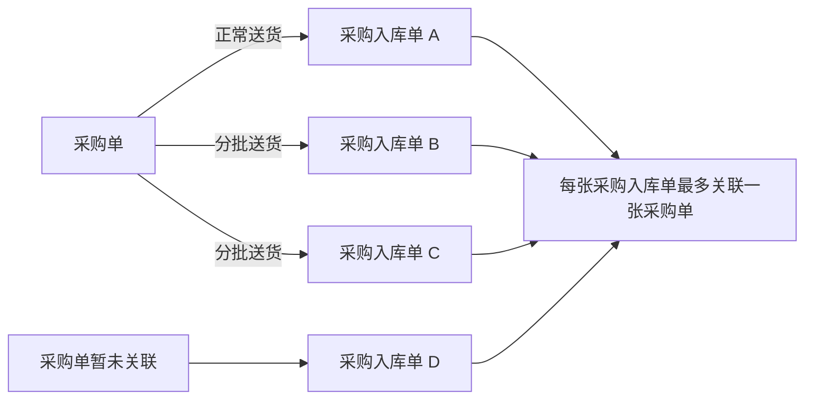
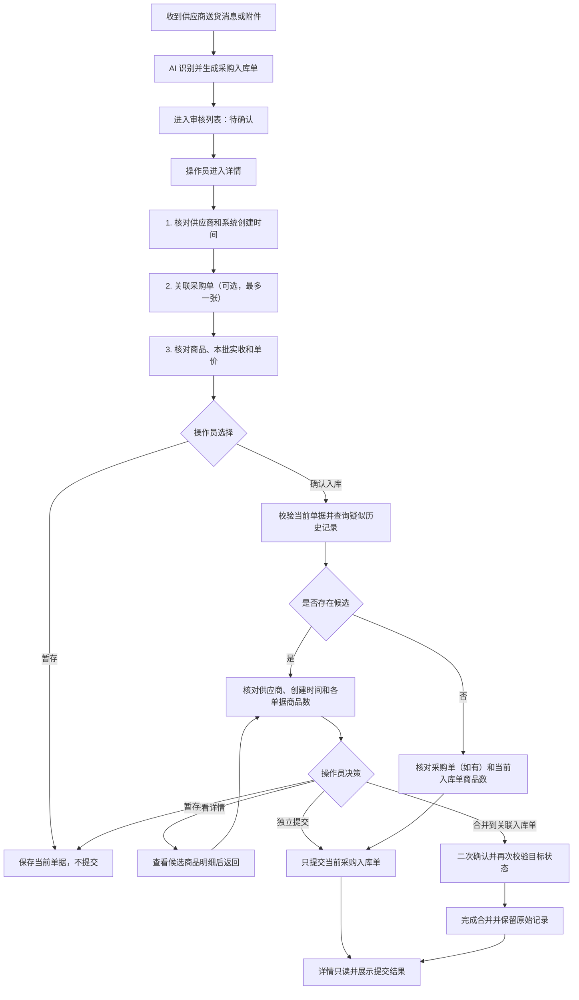

# 采购单与采购入库单优化 PRD（正常送货 / 分批送货）

文档版本：V0.3

更新时间：2026-07-11

适用范围：采购入库单录入、采购入库单审核、采购入库单详情、采购单关联、确认入库弹窗和疑似关联入库单核对。

评审对象：业务负责人、产品、前端、后端和测试。

## 一、需求一句话说明

本期只处理正常送货和分批送货：一张采购单可以对应一张或多张采购入库单，每张采购入库单最多关联一张采购单，也可以暂不关联；确认入库时，系统根据供应商、系统创建时间和采购单关系提示疑似关联入库单，由操作员人工选择暂存、独立提交或合并到关联入库单。

## 二、本次口径修正

1. 采购入库应用的本地状态统一使用“待确认”，不再使用“待审核”。
2. 详情页和确认流程只使用当前系统真实具备的数据。
3. 疑似关联判断依据为供应商、系统创建时间和采购单关系。
4. 确认弹窗中的“商品数”统一指单据商品明细行数。
5. 不累计历史批次的商品实收数量，不进行逐商品差异计算。
6. 当前批次商品行仍保留本批实收、识别到货数、单价和金额，供操作员核对本次入库内容。

## 三、本期范围

### 3.1 包含场景

| 场景 | 单据关系 | 处理方式 |
|---|---|---|
| 正常送货 | 1 张采购单 → 1 张采购入库单 | 核对采购单与当前入库单商品数后独立提交 |
| 关联采购单的分批送货 | 1 张采购单 → 多张采购入库单 | 同供应商、同采购单的历史批次优先提示，人工选择合并或独立提交 |
| 未关联采购单的分批送货 | 当前入库单暂未关联采购单 | 根据同供应商和系统创建时间提示疑似历史批次 |
| 历史批次已经完成 | 采购单存在不可继续合并的历史记录 | 明确提示当前批次独立提交，历史记录保持不变 |
| 暂存 | 当前采购入库单 | 保存本次修改，不提交、不联动其它单据 |
| 已确认查看 | 已确认采购入库单 | 关联关系、明细和处理结果只读 |

### 3.2 不包含场景

| 场景 | 本期结论 |
|---|---|
| 一张采购入库单关联多张采购单 | 不支持，关联控件最多选择一张采购单 |
| 多采购单合并送货 | 不进入当前默认流程 |
| 合并送货与分批送货混合 | 不进入当前默认流程 |
| 系统自动逐商品差异判断 | 不支持，本期只提供单据商品数和当前批次明细核对 |
| 系统自动合并 | 不支持，所有候选必须由操作员人工选择 |
| 采购退货、红冲等逆向业务 | 不属于本需求 |

## 四、核心名词

| 名词 | 定义 | 口径 |
|---|---|---|
| 采购单 | 记录采购计划和采购商品的业务单据 | 1 张采购单可关联 0～多张采购入库单 |
| 采购入库单 | 记录某一次供应商送货和入库确认的业务单据 | 每张可关联 0～1 张采购单 |
| 当前采购入库单 | 操作员正在处理的本次入库记录 | 本次操作只提交这一张 |
| 疑似关联入库单 | 系统根据有限条件找到的历史入库记录 | 只作提示，不代表一定应该合并 |
| 合并到关联入库单 | 把当前分批记录并入一张仍可处理的历史入库单 | 每张原始记录和商品明细继续保留 |
| 商品数 | 单据中商品明细行的数量 | 例如 2 行商品即显示“2 个商品” |
| 本批实收 | 当前采购入库单某一商品实际确认的本次数量 | 只属于当前单，不与历史批次累计比较 |
| 系统创建时间 | 当前系统生成采购入库单任务的时间 | 用于候选排序和人工判断批次是否接近 |

## 五、单据关系



正常一单一入库是分批模型只发生一次送货的特例，因此不需要建立另一套独立的数据关系。

## 六、角色职责

| 角色 / 系统 | 主要职责 |
|---|---|
| 供应商 / 外部材料 | 提供本批商品、到货数量、单价、金额和说明 |
| AI 录单系统 | 识别信息并生成待确认采购入库单 |
| 操作员 | 核对供应商、系统创建时间、采购单关联、商品明细和商品数，并作最终选择 |
| 后端服务 | 保存草稿、查询候选、执行提交或合并、保证幂等并记录操作日志 |
| 外部系统 | 接收入库数据并维护后续处理状态 |

外部处理状态只供系统内部判断历史记录是否仍能合并，不在确认弹窗和候选详情中展示。

## 七、端到端业务链路



## 八、状态模型

### 8.1 采购入库单本地状态

| 状态 | 进入条件 | 允许操作 | 禁止操作 |
|---|---|---|---|
| 待确认 | AI 生成采购入库单任务 | 编辑、关联采购单、暂存、确认入库 | 无 |
| 暂存 | 操作员主动暂存 | 继续编辑、修改关联、再次确认 | 不自动提交 |
| 已确认入库 | 独立提交或合并成功 | 查看来源、关联关系、明细和结果 | 重识别、删除、编辑、暂存、重复确认 |
| 同步失败 | 提交请求失败或结果不确定 | 查看原因、核对结果后重试 | 自动重复创建 |

### 8.2 采购单关联状态

| 状态 | 条件 | 业务含义 |
|---|---|---|
| 未关联 | 采购单没有关联采购入库单 | 可被同供应商的采购入库单选择 |
| 已关联未确认 | 采购单有关联的待确认或暂存采购入库单 | 各张入库单独立处理，不自动联动 |
| 已有入库确认 | 采购单至少有一张采购入库单已确认 | 仍可继续关联后续分批记录 |
| 已关闭不可再关联 | 采购单已经关闭 | 不允许新增关联或确认入库 |

## 九、疑似关联入库单规则

### 9.1 判断条件

1. 当前单与历史单供应商名称相同。
2. 历史单已经确认且仍处于系统内部允许合并的阶段。
3. 当前单和历史单都关联采购单时，两张采购单必须相同。
4. 如果当前单未关联采购单，则按照同供应商提示候选。
5. 候选按系统创建时间从近到远排序，时间只用于人工判断，不自动代表同一次送货。
6. 同一目标入库记录只展示一次。

### 9.2 页面核对依据

| 情况 | 页面显示 |
|---|---|
| 双方关联同一张采购单 | 同采购单、同供应商 |
| 当前单未关联采购单，或历史单未关联采购单 | 同供应商、创建时间 |
| 双方关联不同采购单 | 不生成候选 |

### 9.3 最终校验

点击“合并到此单”不会立即执行。系统必须进入二次确认，并在最终提交时重新查询目标状态；如果目标已经不能合并，则阻断操作并要求刷新候选。

## 十、采购入库单审核列表字段

| 页面字段 | 业务含义 | 来源 / 计算 | 展示规则 |
|---|---|---|---|
| 本地状态 | 当前采购入库单处理进度 | `purchaseTasks.status` | 待确认、暂存、已确认入库 |
| 送货情况 | 帮助操作员识别正常或分批场景 | `purchaseTasks.scenario` | 使用业务语言，不展示技术匹配等级 |
| 系统创建时间 | 当前任务生成时间 | `createdAt` | 完整展示日期和时间 |
| 群聊 | 原始消息来源群 | `group` | 用于追溯业务上下文 |
| 供应商 | 实际送货供应商 | `supplier` | 影响采购单筛选和候选判断 |
| 原文 | AI 识别前的原始内容 | `raw` | 不被人工修正覆盖 |
| 商品数 | 当前单商品明细行数 | `detailItems.length` | 只表示有多少个商品行 |
| 关联采购单 | 当前唯一采购单 | `linkedPurchaseOrderIds[0]` | 可为空，最多一张 |
| 采购单关联状态 | 采购单下入库记录进度 | `getPurchaseOrderFlowStatus()` | 只作提示 |
| 提交提示 | 当前确认可能产生的结果 | `inboundConfirmImpactText()` | 正常提交、发现疑似记录、前批已完成等 |
| 操作员 | 当前负责人 | `auditor` / `operator` | 待确认和暂存可调整，已确认只读 |
| 操作 | 进入处理或执行列表辅助动作 | 前端权限计算 | 已确认行只保留查看 |

## 十一、采购入库单详情字段

### 11.1 顶部与来源信息

| 字段 | 含义 | 来源 | 可编辑性 |
|---|---|---|---|
| 供应商 | 实际送货供应商 | `supplier` | 确认前可修改，确认后只读 |
| 操作员 | 当前处理人 | `auditor` | 详情展示 |
| 来源群聊 | 原始业务消息来源 | `group` | 只读 |
| 系统创建时间 | 当前任务生成时间 | `createdAt` | 只读 |
| 原始文件 | 图片、PDF 或其它附件 | 附件服务 | 只读 / 下载 |
| 原始消息 | AI 识别前完整文本 | `raw` | 只读 |
| 标题问号说明 | 关联采购单和采购入库明细的补充规则 | 前端固定文案 | 鼠标悬浮或键盘聚焦问号时展示 |
| 提交结果 | 独立提交或合并结果 | 提交结果字段 | 已确认详情持续展示 |

### 11.2 单据商品数摘要

| 字段 | 计算口径 | 展示规则 |
|---|---|---|
| 当前采购入库单商品数 | `当前单 detailItems.length` | 显示“X 个商品” |
| 关联采购单商品数 | `采购单 items.length` | 未关联显示“未关联” |

这里的商品数只表示明细行数。例如采购单有生菜和油麦菜两行，即显示“2 个商品”，不表示采购了 2 斤或入库了 2 件。

### 11.3 商品明细字段

| 字段 | 业务含义 | 来源 / 计算 | 可编辑性 | 校验 |
|---|---|---|---|---|
| 序号 | 商品行顺序 | 前端生成 | 只读 | 无 |
| 识别文本 | AI 切分出的原始商品文本 | `detailItems.raw` | 只读 | 用于审核证据 |
| 商品名称 | 人工确认后的商品名称 | `detailItems.name` | 确认前可改 | 不能为空 |
| 本批实收 | 当前单该商品的实际本次数量 | `detailItems.receivedQty` | 确认前可改 | 必须为有效数字且大于 0 |
| 识别到货数/单位 | AI 从原始内容中识别的数量文本 | `detailItems.qty` | 只读 | 不直接替代本批实收 |
| 单价 | 当前单商品单价 | `detailItems.price` | 确认前可改 | 无效时警告 |
| 金额 | 本批实收 × 单价 | 前端即时计算，后端最终确认 | 只读 | 正式数据以后端为准 |
| 备注 | 复称、破损、缺货等说明 | `detailItems.remark` | 确认前可改 | 不参与自动判断 |
| SPU 名称 | 商品主数据匹配结果 | `detailItems.spu` | 本期只读 | 未匹配需人工处理 |
| 商品编码 | 商品主数据编码 | `detailItems.code` | 本期只读 | 未匹配需人工处理 |

## 十二、确认入库弹窗口径

### 12.1 通用原则

1. 只展示操作员当前需要核对的字段。
2. 商品数按单据明细行统计。
3. 不展示外部处理状态。
4. 不自动给出逐商品差异结论。
5. 暂存和取消不会改变历史记录。

### 12.2 各场景展示

| 场景 | 必须展示 | 操作按钮 | 结果 |
|---|---|---|---|
| 正常一单一入库 | 采购单商品数、当前入库单商品数 | 取消、暂存、确认提交 | 独立提交当前单 |
| 未关联采购单且无候选 | 当前入库单商品数 | 取消、暂存、确认提交 | 独立提交当前单 |
| 存在疑似关联入库单 | 供应商、当前单创建时间、采购单商品数（如有）、当前单商品数、候选数量、候选创建时间和候选商品数 | 查看详情、合并到此单、独立提交、暂存、取消 | 人工选择 |
| 合并二次确认 | 采购单商品数（如有）、当前单商品数、目标单商品数、供应商、双方创建时间 | 返回核对、确认合并 | 再校验后合并 |
| 历史批次已完成 | 采购单商品数、当前入库单商品数、本批需独立提交说明 | 取消、暂存、确认提交 | 历史保持不变 |

### 12.3 候选详情

候选详情只读展示供应商、系统创建时间、原始送货信息、商品名称、本批实收、单价、金额和备注。查看详情不会修改历史数据，返回后继续当前确认决策。

## 十三、确认前校验

| 校验项 | 条件 | 级别 | 页面行为 |
|---|---|---|---|
| 供应商 | 为空 | 阻断 | 提示补充后再确认 |
| 商品明细 | 0 行 | 阻断 | 不打开确认弹窗 |
| 商品名称 | 任一行为空 | 阻断 | 提示补全 |
| 单位 | 任一行为空 | 阻断 | 提示补全 |
| 本批实收 | 非数字或小于等于 0 | 阻断 | 提示“实收数量必须大于 0” |
| 采购单供应商 | 与当前单供应商不一致 | 阻断 | 要求解除或更换采购单 |
| 采购单状态 | 已关闭 | 阻断 | 不允许确认 |
| 单价 | 非数字或小于等于 0 | 警告 | 操作员确认是否继续 |
| 目标状态变化 | 二次确认时目标失效 | 阻断 | 提示刷新并重新选择 |
| 重复点击提交 | 同一请求重复到达 | 阻断重复处理 | 前端防抖，后端使用幂等键 |

## 十四、字段写回

| 操作 | 写回字段 | 页面联动 |
|---|---|---|
| 修改供应商 | `task.supplier` | 自动解除供应商不一致的采购单关联并刷新可选采购单 |
| 修改商品名称 | `detailItems[].name` | 写回当前任务 |
| 修改本批实收 | `detailItems[].receivedQty` | 实时刷新当前行金额 |
| 修改单价 | `detailItems[].price` | 实时刷新当前行金额 |
| 修改备注 | `detailItems[].remark` | 立即写回当前任务 |
| 修改识别到货数 | 不允许 | 保留为只读识别证据 |
| 已确认后修改业务字段 | 不允许 | 全部业务输入和关联控件只读 |

## 十五、操作权限与审计

1. 查看候选详情前校验数据权限，无权限时不展示商品和金额明细。
2. 重识别、删除、暂存、独立提交和合并应记录操作人、时间、当前单、目标单和结果。
3. 已确认入库单不提供重识别、删除、暂存或重复确认入口。
4. 合并操作至少记录当前入库单 ID、目标入库单 ID、采购单 ID、操作人和幂等键。
5. 当前单未关联采购单时，已确认详情明确显示“本次确认入库未关联采购单”。

## 十六、接口建议

### 16.1 采购入库单详情

```json
{
  "id": "PI-20260701-014",
  "status": "待确认",
  "supplierId": "SUP-001",
  "supplierName": "春田蔬菜基地",
  "createdAt": "2026-07-01 11:32:18",
  "linkedPurchaseOrderId": "GM-PO-7712",
  "items": [
    {
      "lineId": "LINE-1",
      "rawText": "云南生菜 180 斤",
      "productName": "云南生菜",
      "unit": "斤",
      "recognizedQtyText": "180 斤",
      "receivedQty": 180,
      "price": 3.2,
      "remark": "第二批到货"
    }
  ],
  "version": 3
}
```

### 16.2 确认前检查响应

建议返回：

- 阻断错误与风险警告；
- 采购单商品数；
- 当前采购入库单商品数；
- 候选采购入库单列表；
- 每个候选的供应商、系统创建时间和商品数；
- 候选令牌与数据版本。

### 16.3 最终提交

```json
{
  "inboundId": "PI-20260701-014",
  "action": "MERGE",
  "targetInboundId": "PI-20260701-012",
  "candidateToken": "candidate-token",
  "dataVersion": 3,
  "idempotencyKey": "uuid",
  "warningConfirmed": true
}
```

`action` 建议取值：`SUBMIT_NEW`、`MERGE`、`SAVE_DRAFT`。后端必须在事务内再次校验当前状态、采购单状态、目标状态和幂等键。

## 十七、异常与并发

1. 确认弹窗打开后采购单被关闭：最终提交阻断，要求解除或更换。
2. 候选在二次确认前被其它人处理：合并阻断，刷新候选后重新选择。
3. 网络超时但后端已成功：通过幂等键查询结果，不重复创建。
4. 同一任务被两名操作员同时处理：后提交者收到版本冲突并查看最新结果。
5. 候选无查看权限：只提示存在疑似记录，不展示敏感明细。
6. 单位不一致：不进行跨单位累计或自动换算。

## 十八、验收场景

| 编号 | 前置条件 | 操作 | 预期结果 |
|---|---|---|---|
| AC-01 | 采购单没有历史入库记录 | 确认当前入库单 | 展示采购单和当前单商品数，独立提交成功 |
| AC-02 | 同采购单有可合并历史批次 | 确认当前入库单 | 展示候选、创建时间、商品数和人工决策入口 |
| AC-03 | 未关联采购单，同供应商有候选 | 确认当前入库单 | 不展示采购单商品数，展示供应商、创建时间和候选商品数 |
| AC-04 | 点击合并到此单 | 进入下一步 | 不立即执行，先显示二次确认 |
| AC-05 | 二次确认时目标仍有效 | 确认合并 | 合并成功，原始记录保留，详情只读展示结果 |
| AC-06 | 二次确认时目标失效 | 确认合并 | 阻断并提示刷新，不产生重复记录 |
| AC-07 | 历史批次已完成 | 确认当前入库单 | 明确提示本批独立提交，历史记录不变 |
| AC-08 | 未关联采购单且无候选 | 确认当前入库单 | 只展示当前单商品数，可独立提交 |
| AC-09 | 本批实收为 0 | 确认入库 | 阻断并提示实收数量必须大于 0 |
| AC-10 | 单价无效 | 确认入库 | 显示警告，由操作员决定是否继续 |
| AC-11 | 修改供应商导致采购单不一致 | 修改供应商 | 自动解除原采购单关联 |
| AC-12 | 已确认采购入库单 | 查看列表和详情 | 列表仅查看，详情全部只读 |
| AC-13 | 已确认且未关联采购单 | 查看详情 | 明确显示本次未关联，不展示其它可选采购单 |
| AC-14 | 点击暂存 | 返回列表 | 状态变为暂存，不提交、不联动其它单据 |

## 十九、评审检查清单

### 19.1 业务评审

1. 未关联采购单是否允许直接确认入库。
2. 同供应商候选是否必须增加时间范围限制，还是只按时间排序后人工判断。
3. 单价无效是警告还是正式提交必须阻断。
4. 商品数按明细行统计是否满足一期人工核对需要。
5. 历史批次进入或退出可合并阶段的准确条件。

### 19.2 前端评审

1. 采购入库状态是否全部统一为待确认。
2. 审核列表、详情和确认弹窗是否都展示系统创建时间。
3. 当前单、采购单和候选单的商品数是否清晰区分。
4. 合并是否有二次确认，候选详情是否可返回。
5. 已确认详情是否全部只读并持续展示处理结果。

### 19.3 后端评审

1. 候选查询是否能够按供应商、采购单关系和内部资格返回，并按创建时间排序。
2. 提交接口是否支持幂等、版本校验和事务内二次校验。
3. 合并后是否保留每张原始采购入库单及其商品明细。
4. 商品数是否由后端直接返回，或统一按明细数组长度计算。
5. 无权限候选、状态变化和网络超时的错误码是否明确。

### 19.4 测试评审

1. 正常一单一入库、同采购单分批、未关联采购单分批、历史批次已完成是否覆盖。
2. 暂存、取消、查看详情、返回核对、独立提交和合并二次确认是否覆盖。
3. 空供应商、空商品、实收无效、供应商不一致、采购单关闭和单价异常是否覆盖。
4. 重复点击、并发提交、目标状态变化和网络超时重试是否覆盖。
5. 已确认只读、未关联只读和状态筛选是否覆盖。

## 二十、本次评审需要拍板的事项

| 决策项 | 当前建议 | 确认角色 |
|---|---|---|
| 未关联采购单是否允许确认入库 | 允许；按同供应商提示候选 | 业务负责人 |
| 创建时间是否设置自动匹配时间窗 | 当前只排序和展示，不自动排除较早记录 | 业务、后端 |
| 商品数口径 | 按单据商品明细行统计 | 业务、产品 |
| 单价无效如何处理 | 原型警告，正式提交规则由业务确定 | 业务、财务 |
| 哪些历史单可作为合并目标 | 只允许内部仍处于可合并阶段的历史记录 | 业务、后端 |
| 是否展示外部处理状态 | 不在确认弹窗和候选详情展示 | 业务、产品 |
| 合并是否需要二次确认 | 必须需要，并在最终提交时再次校验 | 业务、前端、后端 |
| 多采购单合并送货是否进入本期 | 不进入，后续单独评估 | 业务负责人 |
| 幂等和并发是否纳入一期后端 | 建议必须纳入 | 后端、测试 |
