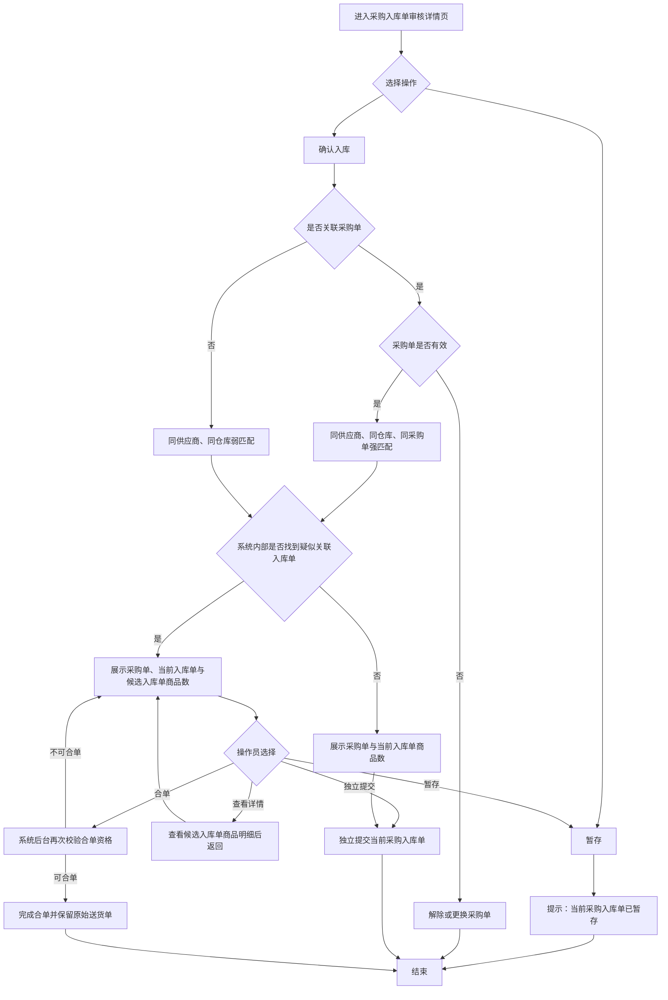

# 采购录入应用字段口径说明

更新时间：2026-07-10

适用范围：采购单录入、采购单审核、采购入库单录入、采购入库单审核、采购入库单详情、采购设置中的计算优先级。

## 一、命名边界

### 采购单

采购单表示采购计划或采购订单，是后续仓库收货的依据。当前原型中采购单确认后会回传观麦系统，并保持观麦业务状态“未提交”，供采购入库单关联。

### 采购入库单

采购入库单表示供应商实际送货、仓库收货和入库确认的业务单据。页面中不再使用泛称“入库单”作为主对象名称，避免和仓库通用入库、销售侧单据混淆。

### 观麦采购单

观麦采购单表示从观麦系统读取或由 AI 采购单确认后回传形成的采购单。只有观麦业务状态为“未提交”且未关闭的采购单允许继续被采购入库单关联。

## 二、核心状态

| 字段 | 取值 | 业务含义 | 异常说明 |
|---|---|---|---|
| 采购入库单状态 | 待审核 | AI 已生成采购入库单，尚未完成人工审核 | 只处理当前送货单，不被其它批次自动提交 |
| 采购入库单状态 | 暂存 | 操作员已暂存，暂不提交观麦 | 不被其它批次自动联动 |
| 采购入库单状态 | 已确认入库 | 当前系统已完成确认 | 详情只读；是否可合并仍取决于观麦审核状态 |
| 采购入库单状态 | 同步失败 | 曾尝试提交但回传异常 | 需要人工处理或重试 |
| 观麦同步状态 | 未同步 / 同步成功 / 同步失败 | 当前系统向观麦写入的结果 | 同步成功后才能参与后续候选匹配 |
| 观麦审核状态 | 未提交 / 待审核 / 已审核 | 观麦员工对入库单的最终审核进度 | 只有待审核单可作为后续分批合并目标 |
| 采购单关联状态 | 未关联 | 当前采购入库单未选择采购单 | 仍可确认入库，按供应商和仓库进行弱匹配 |
| 采购单关联状态 | 已关联未确认 | 采购单已有采购入库单关联，但尚无确认入库记录 | 确认时按关联采购入库单状态提示 |
| 采购单关联状态 | 已有入库确认 | 采购单已有至少一张采购入库单确认入库 | 采购单仍可继续被新的采购入库单关联，支持分批送货 |
| 采购单关联状态 | 已关闭不可再关联 | 采购单已关闭 | 不允许继续关联或确认入库 |

### 提示
当采购单关联了采购入库单后，会根据入库单的处理进度，显示不同的关联状态：

采购入库单是“待审核”或“暂存”
说明入库单还没有正式确认入库。
此时采购单的关联状态是：**已关联未确认**。

采购入库单是“已确认入库”
说明货物已经完成入库确认。
此时采购单的关联状态是：**已有入库确认**。

采购单状态是“已关闭不可再关联”
说明这个采购单已经关闭，不能再关联新的采购入库单。

采购单状态是“未关联”
说明这个采购单目前还没有关联任何采购入库单。

采购入库单状态是“同步失败”
表示入库单同步过程中出了问题，需要重新同步或人工处理。
## 三、采购入库单列表字段

| 页面字段 | 业务含义 | 来源字段 | 数据口径 |
|---|---|---|---|
| 采购入库单状态 | 当前采购入库单处理进度 | `purchaseTasks.status` | 只反映当前单据，不代表采购单整体完成度 |
| 业务场景 | 原型仅覆盖正常送货和分批送货 | `purchaseTasks.scenario` | 展示一单一入库、同采购单强匹配、无采购单弱匹配、历史已完成需独立提交 |
| 时间 | 任务创建或进入审核列表时间 | 原型静态时间 | 正式接口建议返回 `createdAt` / `submittedAt` |
| 群聊 | 采购入库单来源群 | `purchaseTasks.group` | 用于追溯消息来源 |
| 供应商 | 当前采购入库单供应商 | `purchaseTasks.supplier` | 关联采购单时按同供应商过滤 |
| 原文 | AI 识别前的消息或送货单摘要 | `purchaseTasks.raw` | 保留原始口径，不能被修正字段覆盖 |
| 商品数 | AI 识别出的明细行数 | `purchaseTasks.items` | 只统计行数，不代表数量合计 |
| 关联采购单 | 当前采购入库单已选择的采购单 | `linkedPurchaseOrderIds[0]` | 可为空且最多一张，不支持一张入库单关联多张采购单 |
| 采购单关联状态 | 关联采购单在入库链路中的状态 | `getPurchaseOrderFlowStatus(order)` | 由采购单关闭状态和关联采购入库单状态推导 |
| 提交提示 | 本次将新建观麦单或存在强/弱匹配候选 | `inboundConfirmImpactText(task)` | 候选只提示，不自动合并 |
| 操作员 | 当前处理人 | `auditor` / `operator` | 采购侧统一称操作员 |

## 四、采购入库单详情字段

| 页面字段 | 业务含义 | 来源字段 | 计算逻辑 / 关联字段 | 异常说明 |
|---|---|---|---|---|
| 识别文本 | AI 从原始消息中切出的明细文本 | `detailItems.raw` | 用于追溯识别来源 | 不参与计算 |
| 商品名称 | 操作员确认后的商品名称 | `detailItems.name` | 后续映射 SPU | 未匹配 SPU 时需人工确认 |
| 采购数 | 唯一关联采购单中的计划采购数量 | `order.items[].qty` | 未关联采购单时显示“-” | 不从外部送货单反推原订购量 |
| 历史已确认 | 同一采购单下其它已确认批次累计实收 | `getInboundItemProgress()` | 按商品和单位汇总 | 不跨单位自行换算 |
| 本批实收 | 操作员确认的当前批次实际收货数量 | `detailItems.receivedQty` | 当前批次最终入库数量 | 这是入库确认的关键数量 |
| 确认后剩余 | 当前批次确认后的采购余量 | `采购数 - 历史已确认 - 本批实收` | 正数表示待到货，负数表示累计超收 | 未关联采购单时显示“-” |
| 识别到货数/单位 | AI 从供应商送货内容识别到的到货数量文本 | `detailItems.qty` | 用于和实收数对照 | 不直接作为最终入库数量 |
| 单价 | 入库单价 | `detailItems.price` | 金额 = 计算优先级数量 * 单价 | 异常价格进入人工确认 |
| 金额 | 当前行入库金额 | `formatInboundAmount()` | 默认按实收数优先，也可按采购数优先或取两者最小值 | 金额为页面演示计算，正式以后端返回为准 |
| 备注 | 操作员补充说明 | `detailItems.remark` | 用于记录短缺、破损、复称等情况 | 不参与自动流转 |
| SPU 名称 | 商品主数据匹配结果 | `detailItems.spu` | 关联商品主数据 | 未匹配需人工处理 |
| 商品编码 | 商品主数据编码 | `detailItems.code` | 关联商品主数据 | 未匹配需人工处理 |

## 五、统计字段

| 字段 | 计算逻辑 | 数据口径 |
|---|---|---|
| 采购单原订购 | `sum(关联采购单商品采购数)` | 未关联采购单时展示“未关联” |
| 历史已确认 | `sum(同采购单其它已确认批次实收数)` | 用于分批累计提示 |
| 本批实收 | `sum(detailItems.receivedQty)` | 当前送货单明细合计 |
| 确认后剩余 | `采购单原订购 - 历史已确认 - 本批实收` | 负数表示累计超收 |

注意：真实业务中如果同一采购入库单存在不同计量单位，建议后端按商品和单位分组返回聚合值，或直接返回可展示的统计结果。当前原型按数值求和，只用于页面提示，不驱动确认入库。

## 六、金额计算优先级

| 配置 | 取数规则 | 适用场景 |
|---|---|---|
| 实收数优先 | `实收数 * 单价` | 默认规则，按实际收货金额入库 |
| 采购数优先 | `采购数 * 单价` | 需要按采购计划金额核算时使用 |
| 取两者最小值 | `min(采购数, 实收数) * 单价` | 避免多收到货导致金额超采购计划 |

当前页面的默认设置级固定为“实收数优先”。自定义设置启用后，详情页金额会按自定义优先级重新计算。

## 七、关联与确认入库规则

1. 正常“一张采购单对应一张采购入库单”属于一期标准流程，也是分批一对多模型只发生一次送货的特例。
2. 每张采购入库单最多关联一张采购单；采购单为可选项，未关联也允许确认入库。
3. 采购单已关闭时，要求先解除或更换采购单；不支持一张入库单关联多张采购单。
4. 提交时按同一业务组织下的供应商、仓库和观麦审核状态查询候选；同采购单为强匹配，缺少采购单为弱匹配。
5. 只有“同步成功 + 观麦待审核”的历史入库单可作为合并目标；观麦已审核历史只展示，当前批次必须新建。
6. 系统不自动联动其它暂存或待审核入库单；操作员必须明确选择“合单”“独立提交”或“暂存”。
7. 合并后多张本地送货单仍独立保留，但共同指向同一个观麦入库单号。
8. 外部审核状态只作为系统内部候选筛选条件，不在确认入库弹窗和候选入库单详情中展示。
9. 确认弹窗不重复展示当前采购入库单号或采购单提交状态，只展示各类单据的商品数。
10. 商品数按商品明细行数统计，只用于快速核对；一期不计算采购单与各批入库单的逐商品差异。
11. 疑似关联入库单支持查看只读商品详情，返回后继续选择合单、独立提交、暂存或取消。

## 八、真实场景覆盖

| 场景 | 是否满足 | 页面提示 |
|---|---|---|
| 正常一单一入库 | 满足 | 展示采购单与当前入库单商品数后确认提交 |
| 同采购单分批送货 | 满足 | 展示采购单、当前入库单和疑似关联入库单商品数，人工选择合单或独立提交 |
| 未关联采购单分批送货 | 满足 | 按同供应商、同仓库弱匹配并要求人工确认 |
| 历史批次已完成 | 满足 | 不再参与合单，当前批次独立提交 |
| 一张入库单关联多张采购单 | 一期不支持 | 关联控件限制为最多一张 |
| 多采购单合并及混合送货 | 一期不支持 | 不展示入口，不进入一期确认流程 |

## 九、合并送货影响评估

### 评估结论

当前 `fenpi` 版本暂不增加“一张采购入库单关联多张采购单”。该能力出现概率较低，但会改变当前稳定的一对多模型，并明显增加商品归属和操作员审核复杂度，不适合直接并入正常送货/分批送货主流程。

### 对当前代码和业务的影响

| 影响项 | 当前分批送货 | 加入合并送货后的变化 | 风险 |
|---|---|---|---|
| 单据关系 | 一张入库单最多关联一张采购单 | 一张入库单关联多张采购单 | 数据关系升级为多对多 |
| 关联控件 | 单选，可不关联 | 多选，并需区分普通/合并模式 | 容易误选采购单 |
| 商品归属 | 当前入库商品默认属于唯一采购单 | 每条商品必须指定所属采购单 | 操作员逐行分配负担增加 |
| 同商品处理 | 商品只和一张采购单比较 | 同商品可能同时存在于多张采购单 | 无法自动判断数量冲抵顺序 |
| 历史累计 | 按唯一采购单汇总历史实收 | 需要按采购单和商品分别累计 | 分批与合并交叉后口径复杂 |
| 确认弹窗 | 展示一张采购单和关联入库单商品数 | 需展示多张采购单及逐行分配结果 | 审核信息显著增加 |
| 外部送货单 | 只提供本批数量、单价、金额 | 缺少采购单原订购量和逐行归属 | 无可靠自动分配依据 |
| 异常处理 | 供应商、仓库、重复单据等校验 | 还需处理部分分配、跨单超收和撤销分配 | 测试范围大幅扩大 |

### 后续可行的受限方案

若未来确认必须支持，建议单独建立“合并送货”高级模式，不改变默认流程，并同时满足以下条件：

1. 只有具备权限的操作员可主动开启合并送货，默认仍是一张入库单最多关联一张采购单。
2. 多张采购单必须属于同一业务组织、同一供应商、同一仓库，并处于可入库状态。
3. 每一条入库商品必须明确指定一张采购单；相同商品需要跨采购单分配时，必须拆成多行并人工填写分配数量。
4. 未完成逐行采购单归属、分配数量无效或累计超收时禁止提交。
5. 第一期合并送货不得再叠加分批送货；存在历史入库批次的采购单不能进入合并模式。
6. 必须先确认外部系统接口支持一张入库单携带多张采购单及逐行归属信息。
7. 应在独立实验分支实现和评审，通过后再决定是否合入，不直接修改 `fenpi` 稳定分支。

受限模式的操作流程应为：主动开启合并送货 → 选择多张同供应商采购单 → 逐商品指定采购单 → 校验分配完整性 → 展示各采购单商品数及分配结果 → 人工确认提交。

## 十、异常说明

1. 无权限查看的关联采购入库单只展示“存在无权限查看的关联采购入库单”，不暴露明细。
2. 历史采购入库单如果只有摘要，详情页可展示只读字段，不能重新提交。
3. 采购入库单已确认后，关联采购单选择框和明细输入框应只读。
4. 数量单位不一致时，不建议前端自行跨单位合计，应使用后端聚合结果。
5. 单价为空或异常时，金额展示为 0 或进入人工确认，不能自动补齐未知价格。
6. 采购单关闭后，即使页面上仍能看到历史关联记录，也不能新增关联或确认入库。
7. 当前单据没有商品、商品名称或单位为空、实收数小于等于 0 时禁止确认入库。
8. 同一供应商下送货单号重复时禁止提交，避免接口超时或重复上传造成重复入库。
9. 采购单供应商和采购入库单供应商不一致时禁止提交；人工更换供应商时自动解除不一致采购单关联。
10. 累计实收超过采购数量时按商品行提示超收，不使用总剩余数替代逐商品风险判断。
11. 采购入库商品在采购单中找不到同名同单位明细时提示人工核对，但不自动拆分或映射。
12. 审核时修改实收数、单价后必须写回当前任务，并实时更新行金额、本批实收和确认后剩余。
