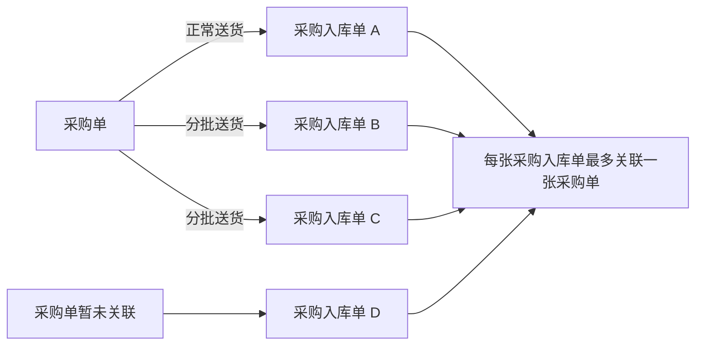
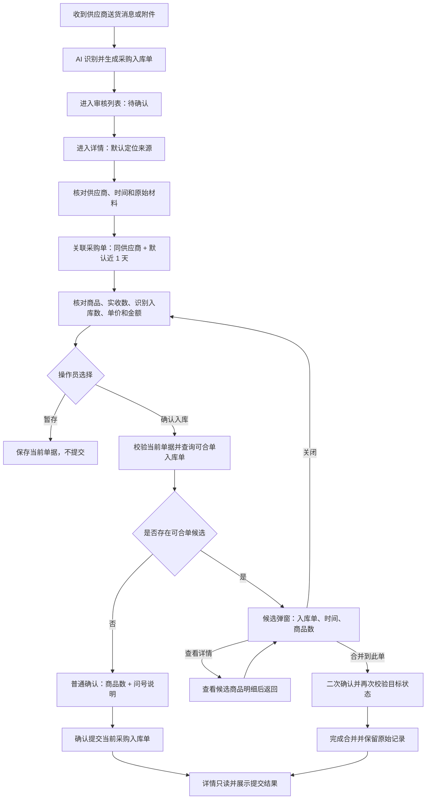

# 采购单与采购入库单优化 PRD（正常送货 / 分批送货）

文档版本：V0.4

更新时间：2026-07-13

适用范围：采购入库单录入、采购入库单审核、采购入库单详情、采购单关联、确认入库弹窗和可合单入库单处理。

评审对象：业务负责人、产品、前端、后端和测试。

## 一、需求一句话说明

本期只处理正常送货和分批送货：一张采购单可以对应一张或多张采购入库单，每张采购入库单最多关联一张采购单，也可以暂不关联；确认入库时，如果存在可合单的入库单，系统展示对应列表、详情入口和合单操作。

## 二、本次口径修正

1. 采购入库应用的本地状态统一使用“待确认”，不再使用“待审核”。
2. 详情页和确认流程只使用当前系统真实具备的数据。
3. 可合单候选由供应商、时间和采购单关系计算，但页面不展示核对依据。
4. 确认弹窗中的“商品数”统一指单据商品明细行数。
5. 不累计历史批次的商品实收数量，不进行逐商品差异计算。
6. 当前批次商品行展示实收数、识别入库数、单价和金额；金额允许操作员人工修改。
7. 采购入库单审核列表保留“合单”入口，并删除“提交提示”列。
8. 详情左侧页签统一为“基本信息 / 群聊消息 / 定位来源”，默认展示“基本信息”。
9. “系统创建时间”统一简化为“时间”。
10. 关联采购单固定当前供应商，默认展示近 1 天，可切换近 3 天、近 7 天和全部时间。
11. 普通确认弹窗的解释文案收进问号，鼠标悬浮或键盘聚焦时展示；候选弹窗不展示核对依据和额外说明。
12. 金额默认自动计算；一旦人工修改，必须标记为人工金额，后续实收数或单价变化不得自动覆盖。

## 三、本期范围

### 3.1 包含场景

| 场景 | 单据关系 | 处理方式 |
|---|---|---|
| 正常送货 | 1 张采购单 → 1 张采购入库单 | 核对采购单与当前入库单商品数后独立提交 |
| 关联采购单的分批送货 | 1 张采购单 → 多张采购入库单 | 同供应商、同采购单的历史批次优先提示，人工选择合并或独立提交 |
| 未关联采购单的分批送货 | 当前入库单暂未关联采购单 | 根据同供应商和时间提示可合单历史批次 |
| 历史批次已经完成 | 采购单存在不可继续合并的历史记录 | 明确提示当前批次独立提交，历史记录保持不变 |
| 暂存 | 当前采购入库单 | 保存本次修改，不提交、不联动其它单据 |
| 已确认查看 | 已确认采购入库单 | 关联关系、明细和处理结果只读 |

### 3.2 不包含场景

| 场景 | 本期结论 |
|---|---|
| 一张采购入库单关联多张采购单 | 不支持，关联控件最多选择一张采购单 |
| 多采购单合并送货 | 不进入当前默认流程 |
| 合并送货与分批送货混合 | 不进入当前默认流程 |
| 系统自动逐商品差异判断 | 不支持，本期只提供单据商品数和当前批次明细核对 |
| 系统自动合并 | 不支持，所有候选必须由操作员人工选择 |
| 采购退货、红冲等逆向业务 | 不属于本需求 |

## 四、核心名词

| 名词 | 定义 | 口径 |
|---|---|---|
| 采购单 | 记录采购计划和采购商品的业务单据 | 1 张采购单可关联 0～多张采购入库单 |
| 采购入库单 | 记录某一次供应商送货和入库确认的业务单据 | 每张可关联 0～1 张采购单 |
| 当前采购入库单 | 操作员正在处理的本次入库记录 | 本次操作只提交这一张 |
| 可合单入库单 | 系统根据供应商、采购单关系、时间和外部状态找到的历史入库记录 | 只作候选，必须由操作员人工决定 |
| 合并到关联入库单 | 把当前分批记录并入一张仍可处理的历史入库单 | 每张原始记录和商品明细继续保留 |
| 商品数 | 单据中商品明细行的数量 | 例如 2 行商品即显示“2 个商品” |
| 实收数 | 当前采购入库单某一商品实际确认的本次数量 | 只属于当前单，不与历史批次累计比较 |
| 时间 | 当前系统生成采购入库单任务的时间 | 用于候选排序和人工判断批次是否接近 |

## 五、单据关系



正常一单一入库是分批模型只发生一次送货的特例，因此不需要建立另一套独立的数据关系。

## 六、角色职责

| 角色 / 系统 | 主要职责 |
|---|---|
| 供应商 / 外部材料 | 提供本批商品、到货数量、单价、金额和说明 |
| AI 录单系统 | 识别信息并生成待确认采购入库单 |
| 操作员 | 核对供应商、时间、采购单关联、商品明细和商品数，并作最终选择 |
| 后端服务 | 保存草稿、查询候选、执行提交或合并、保证幂等并记录操作日志 |
| 观麦系统 | 提供供应商、商品、采购单和入库单数据，接收采购单/入库提交并维护外部业务状态 |

观麦处理状态只供系统内部判断采购单能否关联、历史入库单能否合并以及提交结果，不在确认弹窗和候选详情中直接展示技术状态。

## 七、端到端业务链路



## 八、状态模型

### 8.1 采购入库单本地状态

| 状态 | 进入条件 | 允许操作 | 禁止操作 |
|---|---|---|---|
| 待确认 | AI 生成采购入库单任务 | 编辑、关联采购单、暂存、确认入库 | 无 |
| 暂存 | 操作员主动暂存 | 继续编辑、修改关联、再次确认 | 不自动提交 |
| 已确认入库 | 独立提交或合并成功 | 查看来源、关联关系、明细和结果 | 重识别、删除、编辑、暂存、重复确认 |
| 同步失败 | 提交请求失败或结果不确定 | 查看原因、核对结果后重试 | 自动重复创建 |

### 8.2 采购单关联状态

| 状态 | 条件 | 业务含义 |
|---|---|---|
| 未关联 | 采购单没有关联采购入库单 | 可被同供应商的采购入库单选择 |
| 已关联未确认 | 采购单有关联的待确认或暂存采购入库单 | 各张入库单独立处理，不自动联动 |
| 已有入库确认 | 采购单至少有一张采购入库单已确认 | 仍可继续关联后续分批记录 |
| 已关闭不可再关联 | 采购单已经关闭 | 不允许新增关联或确认入库 |

## 九、可合单入库单规则

### 9.1 判断条件

1. 当前单与历史单供应商名称相同。
2. 历史单已经确认且仍处于系统内部允许合并的阶段。
3. 当前单和历史单都关联采购单时，两张采购单必须相同。
4. 如果当前单未关联采购单，则按照同供应商提示候选。
5. 候选按时间从近到远排序，时间只用于人工判断，不自动代表同一次送货。
6. 同一目标入库记录只展示一次。

### 9.2 页面展示

存在可合单的入库单时，页面只展示候选入库单号、时间、商品数、详情入口和“合并到此单”操作，不展示核对依据或额外说明。

### 9.3 最终校验

点击“合并到此单”不会立即执行。系统必须进入二次确认，并在最终提交时重新查询目标状态；如果目标已经不能合并，则阻断操作并要求刷新候选。

## 十、采购入库单审核列表字段

### 10.1 页面级操作

| 操作 | 行为 | 正式实现要求 |
|---|---|---|
| 查询 | 位于筛选栏右侧，按当前筛选条件查询 | 与重置同组，查询按钮使用主按钮样式 |
| 重置 | 位于查询右侧，清空状态、群聊、操作员和供应商筛选 | 恢复默认列表，不改变数据 |
| 刷新 | 位于列表工具栏右侧第一位，重新拉取任务、采购单关联状态和观麦同步结果 | 刷新时不得覆盖用户尚未保存的详情编辑 |
| 合单 | 位于刷新右侧，进入采购入库单合单选择模式 | 只允许选择同供应商且外部状态可合并的入库单；最终仍需进入详情或二次确认 |

列表不展示“提交提示”列；是否存在可合单入库单，在用户进入详情并点击确认入库时判断。

### 10.2 列表字段

| 页面字段 | 业务含义 | 来源 / 计算 | 展示规则 |
|---|---|---|---|
| 状态 | 当前采购入库单处理进度 | `purchaseTasks.status` | 待确认、暂存、已确认入库 |
| 送货情况 | 帮助操作员识别正常或分批场景 | `purchaseTasks.scenario` | 使用业务语言，不展示技术匹配等级 |
| 时间 | 当前任务生成时间 | `createdAt` | 完整展示日期和时间 |
| 群聊 | 原始消息来源群 | `group` | 用于追溯业务上下文 |
| 供应商 | 实际送货供应商 | `supplier` | 影响采购单筛选和候选判断 |
| 原文 | AI 识别前的原始内容 | `raw` | 不被人工修正覆盖 |
| 商品数 | 当前单商品明细行数 | `detailItems.length` | 只表示有多少个商品行 |
| 关联采购单 | 当前唯一采购单 | `linkedPurchaseOrderIds[0]` | 可为空，最多一张 |
| 采购单关联状态 | 采购单下入库记录进度 | `getPurchaseOrderFlowStatus()` | 只展示状态标签，不重复展示采购单号 |
| 操作员 | 当前负责人 | `auditor` / `operator` | 待确认和暂存可调整，已确认只读 |
| 操作 | 进入处理或执行列表辅助动作 | 前端权限计算 | 已确认行只保留查看 |

## 十一、采购入库单详情字段

### 11.1 顶部与来源信息

| 字段 | 含义 | 来源 | 可编辑性 |
|---|---|---|---|
| 基本信息 / 群聊消息 / 定位来源 | 左侧来源区域三个独立页签；基本信息默认选中 | 前端固定配置 | 可切换 |
| 供应商 | 实际送货供应商 | `supplier` | 确认前可修改，确认后只读 |
| 操作员 | 当前处理人 | `auditor` | 详情展示 |
| 来源群聊 | 原始业务消息来源 | `group` | 只读 |
| 时间 | 当前任务生成时间 | `createdAt` | 只读 |
| 原始文件 | 图片、PDF 或其它附件 | 附件服务 | 只读 / 下载 |
| 原始消息 | AI 识别前完整文本 | `raw` | 只读 |
| 标题问号说明 | 关联采购单和采购入库明细的补充规则 | 前端固定文案 | 鼠标悬浮或键盘聚焦问号时展示 |
| 提交结果 | 独立提交或合并结果 | 提交结果字段 | 已确认详情持续展示 |

### 11.2 关联采购单区域

| 字段 / 操作 | 业务含义 | 数据来源 | 规则 |
|---|---|---|---|
| 供应商 | 当前采购入库单供应商 | 当前单 `supplierId / supplierName` | 固定作为采购单查询条件，不允许在筛选栏单独切换 |
| 采购单时间 | 可关联采购单时间范围 | 查询参数 + 观麦采购单时间 | 默认近 1 天；支持近 3 天、近 7 天和全部时间 |
| 选择 | 当前入库单关联的采购单 | `linkedPurchaseOrderId` | 单选，最多一张；也允许不关联 |
| 采购单 | 观麦采购单号、来源和采购日期 | 观麦采购单接口 | 当前已选采购单即使超出新时间范围仍保留展示，避免用户误以为关联丢失 |
| 采购单关联状态 | 未关联、已关联未确认、已有入库确认、已关闭不可再关联 | 本地关联记录 + 观麦状态 | 观麦关闭后禁止新增关联和确认入库 |
| 关联采购入库单提示 | 是否存在其它关联采购入库单 | 本地关系 + 观麦入库单查询 | 有记录时允许查看历史关联入库单 |
| 详情 | 查看采购单商品明细 | 观麦采购单详情接口 | 只读，不改变关联关系 |

正式环境的“近 1 天”必须使用统一服务端时间和观麦采购单业务时间计算，不使用浏览器本地时间。若观麦只提供日期、不提供时分秒，则按自然日口径处理，并由业务与观麦接口负责人确认边界。

### 11.3 单据商品数摘要

| 字段 | 计算口径 | 展示规则 |
|---|---|---|
| 当前采购入库单商品数 | `当前单 detailItems.length` | 显示“X 个商品” |
| 关联采购单商品数 | `采购单 items.length` | 未关联显示“未关联” |

这里的商品数只表示明细行数。例如采购单有生菜和油麦菜两行，即显示“2 个商品”，不表示采购了 2 斤或入库了 2 件。

### 11.4 商品明细字段

| 字段 | 业务含义 | 来源 / 计算 | 可编辑性 | 校验 |
|---|---|---|---|---|
| 序号 | 商品行顺序 | 前端生成 | 只读 | 无 |
| 识别文本 | AI 切分出的原始商品文本 | `detailItems.raw` | 只读 | 用于审核证据 |
| 商品名称 | 人工确认后的商品名称 | `detailItems.name` | 确认前可改 | 不能为空 |
| 实收数 | 当前单该商品的实际本次数量 | `detailItems.receivedQty` | 确认前可改 | 必须为有效数字且大于 0 |
| 识别入库数 | AI 从原始内容中识别的数量文本 | `detailItems.qty` | 只读 | 不直接替代实收数 |
| 单价 | 当前单商品单价 | `detailItems.price` | 确认前可改 | 无效时警告 |
| 金额 | 默认按实收数 × 单价计算，也可人工修改 | `detailItems.amount` | 确认前可改 | 人工修改后标记 `amountSource=MANUAL`，正式数据以后端为准 |
| 备注 | 复称、破损、缺货等说明 | `detailItems.remark` | 确认前可改 | 不参与自动判断 |
| SPU 名称 | 商品主数据匹配结果 | `detailItems.spu` | 本期只读 | 未匹配需人工处理 |
| 商品编码 | 商品主数据编码 | `detailItems.code` | 本期只读 | 未匹配需人工处理 |

## 十二、确认入库弹窗口径

### 12.1 通用原则

1. 只展示操作员当前需要核对的字段。
2. 商品数按单据明细行统计。
3. 不展示外部处理状态。
4. 不自动给出逐商品差异结论。
5. 暂存和取消不会改变历史记录。
6. 普通确认场景中的解释性文案不直接占据弹窗正文，统一放入标题旁问号；鼠标悬浮、点击聚焦或键盘聚焦时展示。
7. 存在可合单候选时，只展示候选入库单列表、详情入口和合并到此单，不展示核对依据、统计摘要或独立提交说明。

### 12.2 各场景展示

| 场景 | 必须展示 | 操作按钮 | 结果 |
|---|---|---|---|
| 正常一单一入库 | 采购单商品数、当前入库单商品数、两个问号说明 | 取消、暂存、确认提交 | 独立提交当前单 |
| 未关联采购单且无候选 | 当前入库单商品数、两个问号说明 | 取消、暂存、确认提交 | 独立提交当前单 |
| 存在可合单的入库单 | 候选入库单号、时间、商品数 | 查看详情、合并到此单 | 人工选择 |
| 合并二次确认 | 采购单商品数（如有）、当前单商品数、目标单商品数、供应商、双方时间、问号说明 | 返回核对、确认合并 | 再校验后合并 |
| 历史批次已完成 | 采购单商品数、当前入库单商品数、两个问号说明 | 取消、暂存、确认提交 | 历史保持不变 |

### 12.3 问号说明

| 位置 | 标题示例 | 悬浮说明内容 |
|---|---|---|
| 普通确认顶部 | 请核对采购单与本批商品数 / 请核对本批商品数 | 是否存在可合单入库单、当前是否关联采购单，以及本次可执行的确认方式 |
| 普通确认底部 | 本次只处理当前采购入库单 / 历史记录保持不变 | 商品数口径、历史记录不会被修改或联动提交 |
| 合并二次确认顶部 | 确认将当前批次合并到这张关联入库单？ | 原始送货记录保留范围和本次操作边界 |
| 合并二次确认底部 | 仍不确定是否应合并？ | 返回查看详情的方式及合单操作说明 |

问号必须支持鼠标和键盘操作，不能只依赖 `title` 属性；移动端或无悬浮设备应支持点击后展示。

### 12.4 候选详情

候选详情只读展示供应商、时间、原始送货信息、商品名称、实收数、单价、金额和备注。查看详情不会修改历史数据，返回后继续当前确认决策。

## 十三、确认前校验

| 校验项 | 条件 | 级别 | 页面行为 |
|---|---|---|---|
| 供应商 | 为空 | 阻断 | 提示补充后再确认 |
| 商品明细 | 0 行 | 阻断 | 不打开确认弹窗 |
| 商品名称 | 任一行为空 | 阻断 | 提示补全 |
| 单位 | 任一行为空 | 阻断 | 提示补全 |
| 实收数 | 非数字或小于等于 0 | 阻断 | 提示“实收数量必须大于 0” |
| 采购单供应商 | 与当前单供应商不一致 | 阻断 | 要求解除或更换采购单 |
| 采购单状态 | 已关闭 | 阻断 | 不允许确认 |
| 单价 | 非数字或小于等于 0 | 警告 | 操作员确认是否继续 |
| 人工金额 | 非数字或小于 0 | 阻断 | 提示修正金额；0 元是否允许由财务规则确定 |
| 目标状态变化 | 二次确认时目标失效 | 阻断 | 提示刷新并重新选择 |
| 重复点击提交 | 同一请求重复到达 | 阻断重复处理 | 前端防抖，后端使用幂等键 |

## 十四、字段写回

| 操作 | 写回字段 | 页面联动 |
|---|---|---|
| 修改供应商 | `task.supplier` | 自动解除供应商不一致的采购单关联并刷新可选采购单 |
| 修改商品名称 | `detailItems[].name` | 写回当前任务 |
| 修改实收数 | `detailItems[].receivedQty` | 金额未人工修改时刷新当前行金额 |
| 修改单价 | `detailItems[].price` | 金额未人工修改时刷新当前行金额 |
| 修改金额 | `detailItems[].amount`、`detailItems[].amountSource=MANUAL` | 保留人工金额，不再被实收数或单价变化覆盖 |
| 修改备注 | `detailItems[].remark` | 立即写回当前任务 |
| 修改识别入库数 | 不允许 | 保留为只读识别证据 |
| 已确认后修改业务字段 | 不允许 | 全部业务输入和关联控件只读 |

## 十五、操作权限与审计

1. 查看候选详情前校验数据权限，无权限时不展示商品和金额明细。
2. 重识别、删除、暂存、独立提交和合并应记录操作人、时间、当前单、目标单和结果。
3. 已确认入库单不提供重识别、删除、暂存或重复确认入口。
4. 合并操作至少记录当前入库单 ID、目标入库单 ID、采购单 ID、操作人和幂等键。
5. 当前单未关联采购单时，已确认详情明确显示“本次确认入库未关联采购单”。

## 十六、观麦系统数据与功能依赖

### 16.1 系统边界

AI 录单系统负责消息/附件接收、AI 识别、本地草稿、人工审核页面、候选展示和操作审计；观麦系统是供应商、商品、采购单和正式采购入库结果的业务数据源。正式采购单号、正式入库单号及其外部业务状态以观麦返回为准。

页面不得仅凭本地缓存判断采购单仍可关联、目标入库单仍可合并。进入详情可以使用缓存提高速度，但确认提交和确认合并前必须向后端发起最终校验，由后端读取观麦最新状态或可信同步副本。

### 16.2 需要观麦提供的数据

| 数据域 | 观麦需提供的关键字段 | 当前项目用途 | 同步要求 | 必需级别 |
|---|---|---|---|---|
| 租户与授权 | 租户 ID、门店/仓库 ID、授权令牌、接口权限、操作人映射 | 隔离不同租户数据，校验查询和提交权限 | 登录或令牌刷新时更新 | 必须 |
| 供应商主数据 | 供应商 ID、名称、启停状态、别名/编码 | AI 识别归属、详情供应商选择、采购单同供应商筛选 | 增量同步；停用状态及时生效 | 必须 |
| 商品主数据 | SPU ID、商品编码、名称、分类、可用状态 | AI 商品匹配、明细展示、正式入库行写入 | 支持增量和版本号 | 必须 |
| 单位与入库规格 | 单位 ID/名称、采购单位、入库单位、换算关系、精度 | 校验实收数/识别入库数单位，避免错误换算 | 主数据变更后刷新 | 必须 |
| 采购价格 | 供应商商品价、采购价/入库价、币种、税率、有效期 | 默认单价和默认金额；人工金额的合理性校验 | 按业务日期查询，不能只用静态缓存 | 视正式提交规则而定 |
| 采购单头 | 观麦采购单号、供应商 ID、采购日期/时间、业务状态、关闭标记、版本号、来源 | 关联采购单列表、时间筛选、状态阻断 | 详情打开和确认前刷新 | 必须 |
| 采购单明细 | 行 ID、SPU、数量、单位、单价、备注、行状态 | 采购单详情和商品数摘要 | 与采购单头同版本返回 | 必须 |
| 采购入库单头 | 观麦入库单号、供应商、关联采购单、创建时间、同步状态、审核状态、版本号 | 历史记录、候选排序、合单资格、结果展示 | 候选查询和最终提交前刷新 | 必须 |
| 采购入库单明细 | 行 ID、SPU、实收数、识别入库数、单位、单价、金额、备注 | 候选详情、合并目标校验、结果回显 | 查看详情时按权限实时查询 | 必须 |
| 状态字典 | 采购单/入库单状态编码、可关联标记、可合并标记、终态标记 | 将观麦状态映射为“未关联、已有入库确认、已关闭”等页面口径 | 由接口契约统一，不在前端硬编码推测 | 必须 |
| 服务端时间 | 观麦业务时间或统一服务器时间、时区 | 计算近 1/3/7 天采购单范围和并发时间戳 | 每次查询响应返回或统一时钟服务提供 | 必须 |

### 16.3 需要观麦协调的功能能力

| 能力 | 调用方向 | 触发时机 | 观麦侧需要保证的契约 |
|---|---|---|---|
| 主数据同步 | 观麦 → AI 录单 | 定时同步、手工刷新或变更通知 | 支持增量游标/更新时间，返回稳定 ID 和启停状态 |
| 查询可关联采购单 | AI 录单 → 观麦 | 打开采购入库详情、切换时间范围、刷新 | 按租户、供应商、时间范围、可关联状态分页查询，并返回总数和版本 |
| 查询采购单详情 | AI 录单 → 观麦 | 点击采购单详情、确认前核对 | 返回采购单头、完整有效明细及最新状态 |
| 创建/更新采购单 | AI 录单 → 观麦 | AI 采购单人工确认 | 支持幂等键；返回观麦采购单号，并保持约定的“未提交”或其它可关联状态 |
| 查询历史采购入库单 | AI 录单 → 观麦 | 点击确认入库、查看关联历史 | 按供应商、采购单关系和时间查询，并返回是否可合并、权限和版本 |
| 提交前校验 | AI 录单 → 观麦 | 普通确认或合并二次确认前 | 原子校验采购单未关闭、目标入库单仍可处理、版本未变化 |
| 创建采购入库单 | AI 录单 → 观麦 | 普通确认提交 | 支持行级 SPU/单位/数量/单价/金额/备注，返回正式入库单号和处理结果 |
| 合并到目标入库单 | AI 录单 → 观麦 | 点击确认合并 | 观麦必须支持向目标待处理入库单追加或合并明细，并返回合并后的版本；若无此能力，需另行确定替代方案，不能只在本地标记合并 |
| 状态回调或主动回查 | 观麦 → AI 录单，或 AI 录单 → 观麦 | 采购单关闭、入库审核、同步失败恢复 | 至少提供一种可靠机制；事件需带外部单号、状态、版本和发生时间 |
| 幂等结果查询 | AI 录单 → 观麦 | 网络超时、重复点击、任务重试 | 同一幂等键不得重复创建或重复合并，并可查询首次请求结果 |
| 权限校验与审计 | 双向 | 查询详情、提交、合并 | 返回明确的无权限错误；记录租户、操作人、单据、动作、时间和结果 |

### 16.4 本地状态与观麦状态映射

| 页面/本地状态 | 典型观麦状态 | 页面权限 | 协同要求 |
|---|---|---|---|
| 待确认 / 暂存 | 尚未创建正式入库单 | 可编辑、可关联、可确认 | 本地保存，不应提前改变观麦库存或入库状态 |
| 采购单可关联 | 未提交且未关闭，或观麦明确返回 `linkable=true` | 可被单选关联 | 以 `linkable` 契约为准，不仅按状态中文判断 |
| 采购单已关闭 | 已关闭/作废，或 `linkable=false` | 禁止新增关联和确认入库 | 状态变化后及时回调；最终提交再次校验 |
| 已确认入库 | 已返回观麦入库单号且提交成功 | 页面只读 | 保存观麦单号、版本和处理结果 |
| 可合单目标 | 观麦明确返回 `mergeable=true` | 可查看详情并进入合并二次确认 | 二次确认时再次校验 `mergeable` 和版本 |
| 历史已完成 | 已审核/已完成，或 `mergeable=false` | 只读，不作为目标 | 页面不展示技术状态，但内部必须排除 |
| 同步失败 / 结果未知 | 请求失败、超时或观麦未返回确定结果 | 禁止盲目重复创建 | 使用幂等键查询结果，确认失败后才允许重试 |

### 16.5 必须与观麦共同确认的业务问题

1. 观麦采购单“未提交”是否就是唯一可关联状态，还是应直接提供 `linkable` 布尔值和不可关联原因。
2. 观麦采购入库单处于哪些状态时允许追加/合并；已审核、已过账、已关闭等终态如何定义。
3. “合并到此单”在观麦中的真实动作是追加明细、修改原单、建立合并关系，还是重新创建一张汇总入库单。
4. 一张观麦采购入库单是否只允许关联一张采购单；这必须与当前项目“一张入库单最多一张采购单”的模型一致。
5. 观麦是否接受人工金额；若接受，需要金额来源、含税/未税、舍入精度和金额与单价×数量不一致时的校验规则。
6. 采购单时间字段的粒度和时区；“近 1 天”按滚动 24 小时、自然日还是业务日计算。
7. 供应商、商品、单位被停用或修改后，历史单据展示和新单提交分别使用快照还是最新主数据。
8. 状态同步采用 webhook、消息队列还是轮询；回调乱序、重复、漏发时如何按版本处理。
9. 接口限流、批量大小、分页、超时、重试窗口和可用性目标。
10. 租户、仓库、操作员权限如何映射，观麦无权限详情是否只返回脱敏摘要。

### 16.6 不依赖观麦直接提供的内容

| 内容 | 当前责任方 | 说明 |
|---|---|---|
| 群聊消息、图片、PDF 和原始附件 | AI 录单系统/消息渠道 | 观麦无需保存原始沟通材料，除非双方另定附件归档接口 |
| AI 识别文本、置信度、提示词和 AI 记忆 | AI 录单系统 | 属于识别过程数据，不应写入观麦核心单据字段 |
| 本地待确认、暂存状态 | AI 录单系统 | 正式提交前只保存在本系统 |
| 页面页签、问号说明、时间筛选控件和列表布局 | 前端 | 交互由本项目实现，但筛选结果数据来自观麦 |
| 页面批注、PRD 和评审记录 | 本项目 | 产品研发资料，不属于观麦业务数据 |

## 十七、接口建议

### 17.1 采购入库单详情

```json
{
  "tenantId": "TENANT-001",
  "id": "PI-20260701-014",
  "status": "待确认",
  "supplierId": "SUP-001",
  "supplierName": "春田蔬菜基地",
  "createdAt": "2026-07-01 11:32:18",
  "linkedPurchaseOrderId": "GM-PO-7712",
  "gmInboundNo": null,
  "items": [
    {
      "lineId": "LINE-1",
      "rawText": "云南生菜 180 斤",
      "productName": "云南生菜",
      "unit": "斤",
      "recognizedQtyText": "180 斤",
      "receivedQty": 180,
      "price": 3.2,
      "amount": 576,
      "amountSource": "AUTO_CALCULATED",
      "remark": "第二批到货"
    }
  ],
  "version": 3,
  "externalVersion": null
}
```

`amountSource` 建议取值：`AUTO_CALCULATED`、`MANUAL`。人工修改金额时必须同时写回 `MANUAL`。

### 17.2 查询可关联采购单

建议请求参数：

```json
{
  "tenantId": "TENANT-001",
  "supplierId": "SUP-001",
  "rangeDays": 1,
  "anchorTime": "2026-07-03T12:00:00+08:00",
  "linkableOnly": true,
  "page": 1,
  "pageSize": 50
}
```

建议响应除采购单列表外同时返回 `serverTime`、状态编码、`linkable`、不可关联原因和外部版本。切换近 3 天、近 7 天或全部时间时只改变时间参数，不改变当前供应商。

### 17.3 确认前检查响应

建议返回：

- 阻断错误与风险警告；
- 采购单商品数；
- 当前采购入库单商品数；
- 候选采购入库单列表；
- 每个候选的供应商、时间和商品数；
- 候选令牌与数据版本。

### 17.4 最终提交

```json
{
  "inboundId": "PI-20260701-014",
  "action": "MERGE",
  "targetInboundId": "PI-20260701-012",
  "candidateToken": "candidate-token",
  "dataVersion": 3,
  "externalVersion": "gm-version-8",
  "idempotencyKey": "uuid",
  "warningConfirmed": true
}
```

`action` 建议取值：`SUBMIT_NEW`、`MERGE`、`SAVE_DRAFT`。后端必须在事务内再次校验当前状态、采购单状态、目标状态和幂等键。

## 十八、异常与并发

1. 确认弹窗打开后采购单被关闭：最终提交阻断，要求解除或更换。
2. 候选在二次确认前被其它人处理：合并阻断，刷新候选后重新选择。
3. 网络超时但后端已成功：通过幂等键查询结果，不重复创建。
4. 同一任务被两名操作员同时处理：后提交者收到版本冲突并查看最新结果。
5. 候选无查看权限：只提示存在受限的可合单记录，不展示敏感明细。
6. 单位不一致：不进行跨单位累计或自动换算。

## 十九、验收场景

| 编号 | 前置条件 | 操作 | 预期结果 |
|---|---|---|---|
| AC-01 | 采购单没有历史入库记录 | 确认当前入库单 | 展示采购单和当前单商品数，独立提交成功 |
| AC-02 | 同采购单有可合并历史批次 | 确认当前入库单 | 只展示候选入库单、时间、商品数、详情和合并入口 |
| AC-03 | 未关联采购单，同供应商有候选 | 确认当前入库单 | 不展示核对依据或额外说明，只展示候选列表和操作 |
| AC-04 | 点击合并到此单 | 进入下一步 | 不立即执行，先显示二次确认 |
| AC-05 | 二次确认时目标仍有效 | 确认合并 | 合并成功，原始记录保留，详情只读展示结果 |
| AC-06 | 二次确认时目标失效 | 确认合并 | 阻断并提示刷新，不产生重复记录 |
| AC-07 | 历史批次已完成 | 确认当前入库单 | 明确提示本批独立提交，历史记录不变 |
| AC-08 | 未关联采购单且无候选 | 确认当前入库单 | 只展示当前单商品数，可独立提交 |
| AC-09 | 实收数为 0 | 确认入库 | 阻断并提示实收数量必须大于 0 |
| AC-10 | 单价无效 | 确认入库 | 显示警告，由操作员决定是否继续 |
| AC-11 | 修改供应商导致采购单不一致 | 修改供应商 | 自动解除原采购单关联 |
| AC-12 | 已确认采购入库单 | 查看列表和详情 | 列表仅查看，详情全部只读 |
| AC-13 | 已确认且未关联采购单 | 查看详情 | 明确显示本次未关联，不展示其它可选采购单 |
| AC-14 | 点击暂存 | 返回列表 | 状态变为暂存，不提交、不联动其它单据 |
| AC-15 | 打开待确认入库详情 | 查看关联采购单 | 默认仅查询当前供应商、近 1 天且可关联的观麦采购单 |
| AC-16 | 默认范围无目标采购单 | 切换近 3 天/近 7 天/全部时间 | 供应商条件不变，列表补充对应时间范围采购单 |
| AC-17 | 手工修改金额后再修改单价 | 编辑明细 | 金额保留人工值，`amountSource` 为 `MANUAL` |
| AC-18 | 打开普通确认弹窗 | 悬浮或聚焦问号 | 说明出现；移出或失焦后说明隐藏，正文不重复展示 |
| AC-19 | 确认弹窗打开后观麦采购单关闭 | 确认提交 | 最终校验阻断，不创建观麦入库单 |
| AC-20 | 观麦提交超时但实际已成功 | 使用同一幂等键重试/查询 | 返回首次成功结果，不重复创建或合并 |

## 二十、评审检查清单

### 20.1 业务评审

1. 未关联采购单是否允许直接确认入库。
2. 同供应商候选是否必须增加时间范围限制，还是只按时间排序后人工判断。
3. 单价无效是警告还是正式提交必须阻断。
4. 商品数按明细行统计是否满足一期人工核对需要。
5. 历史批次进入或退出可合并阶段的准确条件。
6. 观麦是否接受人工金额及金额与单价×实收数不一致的单据。

### 20.2 前端评审

1. 采购入库状态是否全部统一为待确认。
2. 审核列表、详情和确认弹窗是否都展示时间。
3. 当前单、采购单和候选单的商品数是否清晰区分。
4. 关联采购单是否默认同供应商近 1 天，并可切换其它时间范围。
5. 确认说明是否只在问号悬浮、点击或键盘聚焦时展示。
6. 人工金额是否可编辑并在后续修改单价时保持不变。
7. 合并是否有二次确认，候选详情是否可返回。
8. 已确认详情是否全部只读并持续展示处理结果。

### 20.3 后端评审

1. 候选查询是否能够按供应商、采购单关系、时间和观麦可合并标记返回。
2. 提交接口是否支持幂等、版本校验和事务内二次校验。
3. 合并后是否保留每张原始采购入库单及其商品明细。
4. 商品数是否由后端直接返回，或统一按明细数组长度计算。
5. 无权限候选、状态变化和网络超时的错误码是否明确。
6. 观麦主数据、采购单、入库单状态同步和外部版本字段是否完整。

### 20.4 测试评审

1. 正常一单一入库、同采购单分批、未关联采购单分批、历史批次已完成是否覆盖。
2. 暂存、取消、查看详情、返回核对、独立提交和合并二次确认是否覆盖。
3. 空供应商、空商品、实收无效、供应商不一致、采购单关闭和单价异常是否覆盖。
4. 重复点击、并发提交、目标状态变化和网络超时重试是否覆盖。
5. 已确认只读、未关联只读和状态筛选是否覆盖。
6. 采购单时间筛选、人工金额、问号说明和观麦状态变化是否覆盖。

## 二十一、本次评审需要拍板的事项

| 决策项 | 当前建议 | 确认角色 |
|---|---|---|
| 未关联采购单是否允许确认入库 | 允许；按同供应商提示候选 | 业务负责人 |
| “近 1 天”的时间锚点和粒度 | 建议使用统一服务端时间；滚动 24 小时、自然日或业务日需拍板 | 业务、观麦接口负责人、后端 |
| 商品数口径 | 按单据商品明细行统计 | 业务、产品 |
| 单价无效如何处理 | 原型警告，正式提交规则由业务确定 | 业务、财务 |
| 哪些历史单可作为合并目标 | 只允许内部仍处于可合并阶段的历史记录 | 业务、后端 |
| 是否展示外部处理状态 | 不在确认弹窗和候选详情展示 | 业务、产品 |
| 合并是否需要二次确认 | 必须需要，并在最终提交时再次校验 | 业务、前端、后端 |
| 多采购单合并送货是否进入本期 | 不进入，后续单独评估 | 业务负责人 |
| 幂等和并发是否纳入一期后端 | 建议必须纳入 | 后端、测试 |
| 观麦是否提供 `linkable / mergeable` | 建议由观麦直接返回布尔值和原因，避免本地猜测状态 | 观麦接口负责人、后端 |
| 观麦是否支持向目标入库单追加/合并 | 必须确认；不支持时需重新设计“合并到此单” | 业务、观麦接口负责人、后端 |
| 人工金额提交规则 | 建议携带 `amountSource=MANUAL`，由观麦校验精度、税率和差异 | 业务、财务、观麦接口负责人 |
| 状态同步机制 | 建议 webhook/消息通知为主、主动回查兜底 | 观麦接口负责人、后端、运维 |
