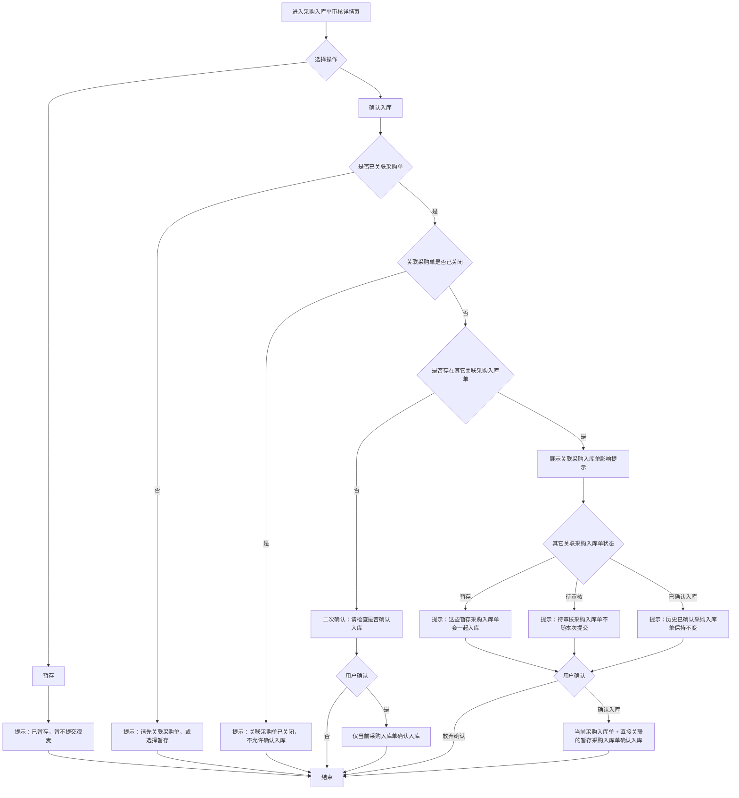

# 采购录入应用字段口径说明

更新时间：2026-07-09

适用范围：采购单录入、采购单审核、采购入库单录入、采购入库单审核、采购入库单详情、采购设置中的计算优先级。

## 一、命名边界

### 采购单

采购单表示采购计划或采购订单，是后续仓库收货的依据。当前原型中采购单确认后会回传观麦系统，并保持观麦业务状态“未提交”，供采购入库单关联。

### 采购入库单

采购入库单表示供应商实际送货、仓库收货和入库确认的业务单据。页面中不再使用泛称“入库单”作为主对象名称，避免和仓库通用入库、销售侧单据混淆。

### 观麦采购单

观麦采购单表示从观麦系统读取或由 AI 采购单确认后回传形成的采购单。只有观麦业务状态为“未提交”且未关闭的采购单允许继续被采购入库单关联。

## 二、核心状态

| 字段 | 取值 | 业务含义 | 异常说明 |
|---|---|---|---|
| 采购入库单状态 | 待审核 | AI 已生成采购入库单，尚未完成人工审核 | 不参与本次确认入库联动 |
| 采购入库单状态 | 暂存 | 操作员已暂存，暂不提交观麦 | 可在同一采购单被其它采购入库单确认时联动入库 |
| 采购入库单状态 | 已确认入库 | 已完成入库确认 | 详情只读，不再重复提交 |
| 采购入库单状态 | 同步失败 | 曾尝试提交但回传异常 | 需要人工处理或重试 |
| 采购单入库流转状态 | 未关联 | 当前采购入库单未选择采购单 | 不能确认入库，只能关联采购单或暂存 |
| 采购单入库流转状态 | 已关联未确认 | 采购单已有采购入库单关联，但尚无确认入库记录 | 确认时按关联采购入库单状态提示 |
| 采购单入库流转状态 | 已有入库确认 | 采购单已有至少一张采购入库单确认入库 | 采购单仍可继续被新的采购入库单关联，支持分批送货 |
| 采购单入库流转状态 | 已关闭不可再关联 | 采购单已关闭 | 不允许继续关联或确认入库 |

## 三、采购入库单列表字段

| 页面字段 | 业务含义 | 来源字段 | 数据口径 |
|---|---|---|---|
| 采购入库单状态 | 当前采购入库单处理进度 | `purchaseTasks.status` | 只反映当前单据，不代表采购单整体完成度 |
| 流程场景 | 原型用于覆盖分批、合并、混合等业务样例 | `purchaseTasks.scenario` | 仅用于产品走查，不建议作为正式接口字段 |
| 时间 | 任务创建或进入审核列表时间 | 原型静态时间 | 正式接口建议返回 `createdAt` / `submittedAt` |
| 群聊 | 采购入库单来源群 | `purchaseTasks.group` | 用于追溯消息来源 |
| 供应商 | 当前采购入库单供应商 | `purchaseTasks.supplier` | 关联采购单时按同供应商过滤 |
| 原文 | AI 识别前的消息或送货单摘要 | `purchaseTasks.raw` | 保留原始口径，不能被修正字段覆盖 |
| 商品数 | AI 识别出的明细行数 | `purchaseTasks.items` | 只统计行数，不代表数量合计 |
| 关联采购单 | 当前采购入库单已选择的采购单 | `linkedPurchaseOrderIds` | 可多选，用于合并送货场景 |
| 采购单入库流转状态 | 关联采购单在入库链路中的状态 | `getPurchaseOrderFlowStatus(order)` | 由采购单关闭状态和关联采购入库单状态推导 |
| 确认入库影响 | 本次确认会影响哪些采购入库单 | `inboundConfirmImpactText(task)` | 只做提示，不做数量决策 |
| 操作员 | 当前处理人 | `auditor` / `operator` | 采购侧统一称操作员 |

## 四、采购入库单详情字段

| 页面字段 | 业务含义 | 来源字段 | 计算逻辑 / 关联字段 | 异常说明 |
|---|---|---|---|---|
| 识别文本 | AI 从原始消息中切出的明细文本 | `detailItems.raw` | 用于追溯识别来源 | 不参与计算 |
| 商品名称 | 操作员确认后的商品名称 | `detailItems.name` | 后续映射 SPU | 未匹配 SPU 时需人工确认 |
| 采购数 | 关联采购单中的计划采购数量 | `detailItems.purchaseQty` | 用于差异和统计 | 合并多采购单时应由后端按行返回对应采购数 |
| 实收数 | 操作员确认的实际收货数量 | `detailItems.receivedQty` | 差异 = 采购数 - 实收数 | 这是入库确认的关键数量 |
| 差异 | 采购数和实收数的差额 | `purchaseQty - receivedQty` | 正数表示少收，负数表示多收 | 原型只展示，不阻断确认入库 |
| 识别到货数/单位 | AI 从供应商送货内容识别到的到货数量文本 | `detailItems.qty` | 用于和实收数对照 | 不直接作为最终入库数量 |
| 单价 | 入库单价 | `detailItems.price` | 金额 = 计算优先级数量 * 单价 | 异常价格进入人工确认 |
| 金额 | 当前行入库金额 | `formatInboundAmount()` | 默认按实收数优先，也可按采购数优先或取两者最小值 | 金额为页面演示计算，正式以后端返回为准 |
| 备注 | 操作员补充说明 | `detailItems.remark` | 用于记录短缺、破损、复称等情况 | 不参与自动流转 |
| SPU 名称 | 商品主数据匹配结果 | `detailItems.spu` | 关联商品主数据 | 未匹配需人工处理 |
| 商品编码 | 商品主数据编码 | `detailItems.code` | 关联商品主数据 | 未匹配需人工处理 |

## 五、统计字段

| 字段 | 计算逻辑 | 数据口径 |
|---|---|---|
| 总采购数 | `sum(detailItems.purchaseQty)` | 当前采购入库单明细合计 |
| 总实收数 | `sum(detailItems.receivedQty)` | 当前采购入库单明细合计 |
| 总差异数 | `总采购数 - 总实收数` | 正数表示少收，负数表示多收 |
| 总差异占比 | `(总采购数 - 总实收数) / 总采购数` | 总采购数为 0 时展示 0.0% |

注意：真实业务中如果同一采购入库单存在不同计量单位，建议后端按商品和单位分组返回聚合值，或直接返回可展示的统计结果。当前原型按数值求和，只用于页面提示，不驱动确认入库。

## 六、金额计算优先级

| 配置 | 取数规则 | 适用场景 |
|---|---|---|
| 实收数优先 | `实收数 * 单价` | 默认规则，按实际收货金额入库 |
| 采购数优先 | `采购数 * 单价` | 需要按采购计划金额核算时使用 |
| 取两者最小值 | `min(采购数, 实收数) * 单价` | 避免多收到货导致金额超采购计划 |

当前页面的默认设置级固定为“实收数优先”。自定义设置启用后，详情页金额会按自定义优先级重新计算。

## 七、关联与确认入库规则

1. 采购入库单未关联采购单时，不能确认入库，系统提示“请先关联采购单，或选择暂存”。
2. 采购单已关闭时，不允许继续关联或确认入库。
3. 采购单已有入库确认后，不自动关闭，仍允许新的采购入库单继续关联，用于支持分批送货。
4. 同一采购单下存在其它“暂存”采购入库单时，本次确认会提示并联动这些直接关联采购入库单一起入库。
5. 同一采购单下存在其它“待审核”采购入库单时，本次确认只提示，不会提交这些待审核单据。
6. 已确认入库的历史采购入库单只作为提示，不重复提交。
7. 联动范围只包含当前采购入库单直接关联的采购单下的直接关联采购入库单，不沿其它采购入库单继续扩散。



## 八、真实场景覆盖

| 场景 | 是否满足 | 页面提示 |
|---|---|---|
| 分批送货 | 满足 | 采购单已有入库确认后仍可继续被新的采购入库单关联 |
| 合并送货 | 满足 | 当前采购入库单可关联多个采购单，确认前按关联采购单展示影响 |
| 分批 + 合并混合 | 满足 | 当前单据只处理直接关联采购单下的直接关联采购入库单，不递归扩散 |
| 其它关联单据待审核 | 满足 | 只提示，不随本次确认提交 |
| 其它关联单据暂存 | 满足 | 明确提示后随本次确认一起入库 |
| 采购单关闭 | 满足 | 阻断继续关联和确认入库 |

## 九、开发对接口径建议

后端建议按以下结构返回采购入库单详情：

```json
{
  "inboundId": "PI-20260701-011",
  "status": "待审核",
  "supplierId": "S3866320",
  "supplierName": "海盛水产",
  "operatorName": "陈林",
  "sourceGroupName": "海鲜供应商对接群",
  "linkedPurchaseOrderIds": ["GM-PO-8801"],
  "items": [
    {
      "rawText": "鲈鱼 80 条",
      "productName": "鲜活鲈鱼",
      "purchaseQty": 82,
      "receivedQty": 80,
      "recognizedQtyText": "80 条",
      "unit": "条",
      "price": 18.5,
      "spuName": "鲜活鲈鱼",
      "productCode": "SPU-P-1001",
      "remark": "到仓复称"
    }
  ],
  "summary": {
    "totalPurchaseQty": 82,
    "totalReceivedQty": 80,
    "totalDiffQty": 2,
    "totalDiffRate": 0.0244
  }
}
```

关联采购单建议返回：

```json
{
  "purchaseOrderId": "GM-PO-8801",
  "gmStatus": "未提交",
  "inboundFlowStatus": "已有入库确认",
  "linkedInboundRecords": [
    {
      "inboundId": "PI-20260630-031",
      "status": "已确认入库",
      "arrivalDate": "2026-06-30",
      "supplierName": "海盛水产",
      "permission": "可查看"
    }
  ]
}
```

## 十、异常说明

1. 无权限查看的关联采购入库单只展示“存在无权限查看的关联采购入库单”，不暴露明细。
2. 历史采购入库单如果只有摘要，详情页可展示只读字段，不能重新提交。
3. 采购入库单已确认后，关联采购单选择框和明细输入框应只读。
4. 数量单位不一致时，不建议前端自行跨单位合计，应使用后端聚合结果。
5. 单价为空或异常时，金额展示为 0 或进入人工确认，不能自动补齐未知价格。
6. 采购单关闭后，即使页面上仍能看到历史关联记录，也不能新增关联或确认入库。
