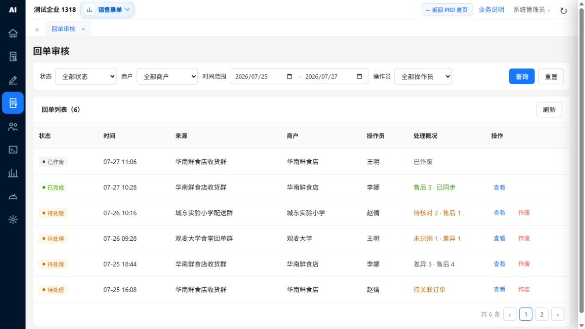
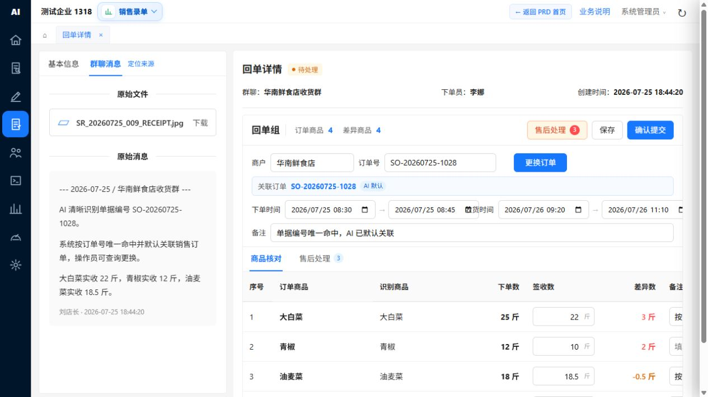
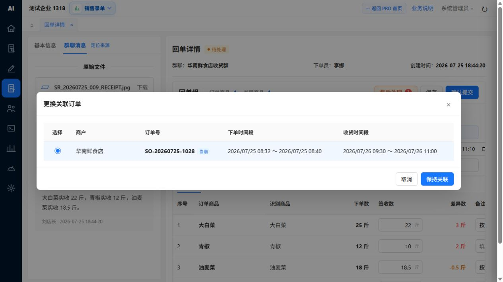
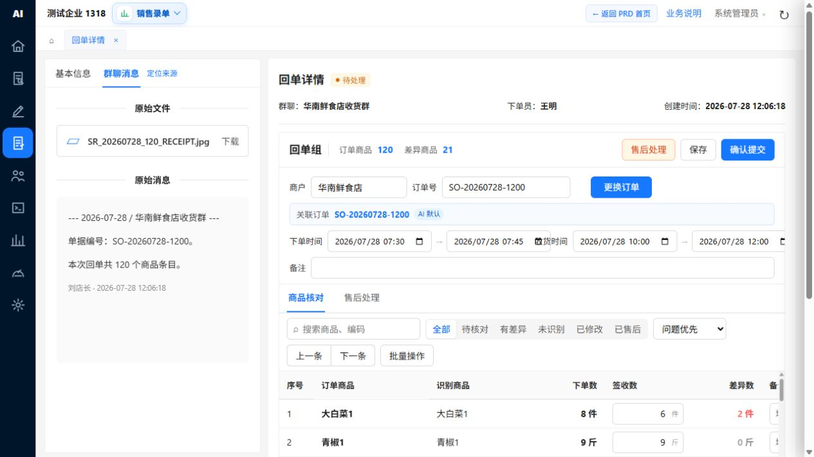
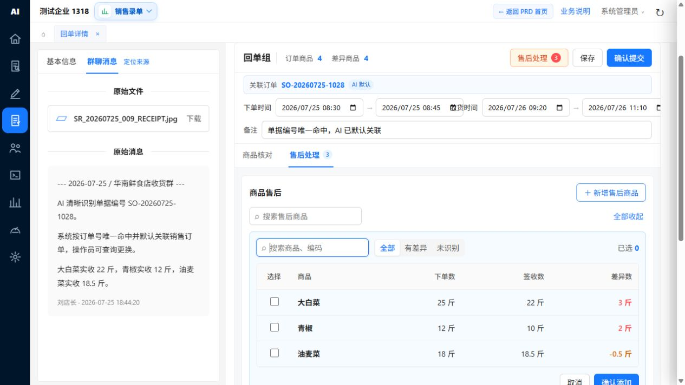
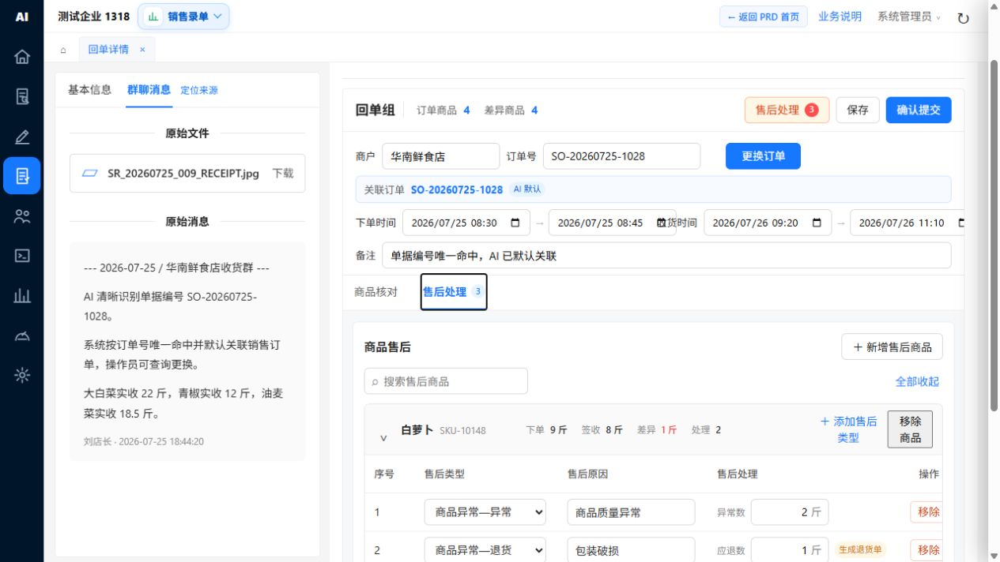
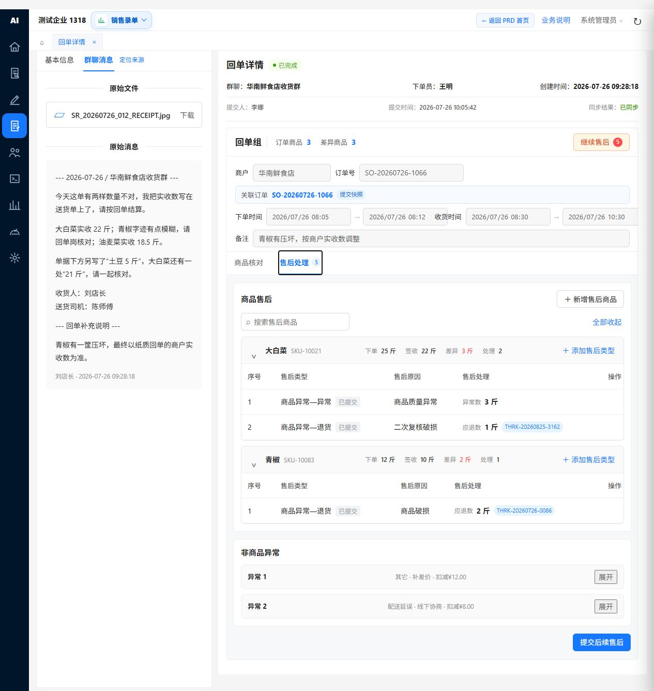

# 销售回单操作说明

## 1. 使用范围

本说明适用于销售回单的查询、订单关联、商品核对、售后登记、非商品异常、提交及完成后的后续售后。

在回单中录入实收数（页面显示为“签收数”）后，能否写入销售订单实收数，以及是否同步出库数，取决于销售订单状态：

| 销售订单状态 | 写入实收数 | 同步修改出库数 |
| --- | --- | --- |
| 等待分拣 | 不允许 | 不允许 |
| 分拣中 | 满足权限和配置时允许 | 满足权限和配置时允许 |
| 配送中 | 满足权限和配置时允许 | 满足权限和配置时允许 |
| 已签收 | 满足权限和配置时允许 | 满足权限和配置时允许 |

如订单已锁定、操作人无权限、未支付的先款后货订单，或商品已发生退货/异常，系统可能限制相关数量修改。

## 2. 查询回单任务

1. 进入“销售回单”任务列表。
2. 按状态、商户、时间范围和操作员设置查询条件。
3. 点击“查询”查看结果；点击“重置”清空条件；点击“刷新”获取最新任务。
4. 在目标任务的操作列点击“查看”，进入回单详情。

## 3. 查看原始回单信息

1. 在详情页左侧查看原始图片、文字或消息记录。
2. 原始材料只用于核对，不在审核过程中改写。
3. 对照右侧当前销售订单、商户及商品识别结果，确认材料归属正确。

## 4. 核对或更换销售订单

1. 查看页面显示的当前关联销售订单。
2. 关联错误或未关联时，调整商户、订单号、下单时间或收货时间条件。
3. 根据页面当前状态点击“查询订单”或“更换订单”，在候选订单中选择并确认。
4. 更换成功后，页面按新订单重新生成商品明细，尚未提交的商品售后被清空；非商品异常继续保留，但提交前需重新确认。
5. 取消更换或更换失败时，原关联订单及当前编辑内容保持不变。

注意：已提交回单不可更换原销售订单；未关联有效销售订单时不能提交。

## 5. 核对商品、出库数与实收数

在“商品核对”标签页逐行处理：

1. 核对“订单商品”与“识别商品”是否一致。
2. 查看只读的“下单数”和“出库数”。下单数仅用于对照，出库数是回单运算基准。
3. 在“签收数”中按基本单位填写商户实际收到的实收数量。
4. 查看系统计算的“差异数”。当前页面按基本单位计算“出库数－实收数”。
5. 对未识别、重复识别、订单无此商品或实收数缺失的内容进行人工核对；这些识别内容仅供核对，不回写销售订单商品。
6. 需要售后的商品进入“售后处理”登记；整张回单没有售后内容时，在最终提交确认中明确确认无需售后。

填写数量时注意：

- 实收数空白表示尚未确认，不能用空白代替 `0`。
- `0` 表示明确未收到商品。
- 出库数可能小于、等于或大于下单数；回单差异与售后处理均依据出库数，下单数不参与运算。
- 差异数统一按“出库数－实收数”计算。

## 6. 了解实收数的更新范围

提交回单前，按以下顺序判断是否会影响其他单据：

1. 站点未开启“按销售实收结算”：回单实收数只保存在回单结果中，不写入销售订单实收数。
2. 已开启“按销售实收结算”：满足状态、权限和锁定条件时，回单实收数写入销售订单实收数。
3. 未开启“实收数同步更新出库数”：销售订单出库数不变。
4. 已开启该功能且商户在同步范围内：销售订单出库数可随实收数变化。
5. 销售出库单未出库时，可随新的出库数同步；已出库时，只有具备相应权限才会冲销并重新出库。
6. 配送单未被人工修改和锁定时，可随出库数同步；只修改实收数时，配送单不变。

同次提交既更新数量又登记商品售后时：已有历史生效售后的商品不得再修改出库数；没有历史售后的商品先计算本次更新后的有效出库数，再按该数量校验异常数和累计退货数。全部校验通过后，数量更新与售后记录才一并生效；任一商品超限时，本次数量更新和售后记录均不生效。

商品已有历史生效售后且站点开启出库数同步时，实收数仍可按规则写入，但该商品跳过出库数同步，页面提示“商品已有售后，出库数保持不变”。

## 7. 大量商品快速处理

订单商品达到 30 条及以上时：

1. 使用商品搜索快速定位目标商品。
2. 按核对状态筛选待处理项。
3. 使用“上一条／下一条”逐项跳转到问题商品。
4. 点击“批量操作”，按需要执行“选择当前结果”“加入售后”“批量备注”或“标记已核对”。
5. 如批量结果不符合预期，使用“撤销”恢复后再逐行处理。

批量标记已核对不会自动填写实收数，也不会删除已登记的售后内容；提交前仍会校验全部商品。

## 8. 登记商品售后

### 8.1 新增售后商品

1. 切换到“售后处理”标签页。
2. 点击“新增售后商品”。
3. 搜索并选择当前有效出库数大于 `0` 的销售订单商品；出库数为 `0` 的商品不能添加商品售后。
4. 确认后，商品进入当前售后处理区。

商品是否存在出库数与实收数差异，不影响人工选择；只要确有售后需要即可登记，但售后数量判断统一以实际出库商品和当前有效出库数为基础。

### 8.2 添加售后类型

1. 在商品右侧点击“添加售后类型”。
2. 选择“商品异常—异常”或“商品异常—退货”。
3. 填写售后原因。
4. 异常类填写“异常数”；退货类填写“应退数”。
5. 同一商品有多个问题时，继续添加新的售后类型。

异常数量校验：

- 单条异常数必须大于 `0` 且不得超过当前有效出库数。
- 不同异常原因可指向同一批商品，因此多条异常数不做累计扣减；退货数量仍按累计上限校验。

退货数量校验：

- 历史累计退货数与本次应退数之和不得超过当前有效出库数，不以下单数或实收数作为退货上限。
- 多次售后共用同一个累计上限；累计范围包含当前销售订单商品的全部有效、已提交退货记录，包括其他有效售后入口产生的退货记录。
- 作废或未生效的退货记录不占用退货额度；不同单位应先换算为基本单位再累计。
- 每次提交前按最新有效出库数和最新有效退货历史重新校验剩余可退数量；累计退货已达到或超过出库数时，不允许新增退货。
- 同次提交会修改出库数时，以本次更新完成后的有效出库数作为退货上限；重新校验超限时，本次数量更新和售后记录均不生效。

## 9. 登记非商品异常

非商品异常用于配送、服务、单据等整张回单层面的问题，不添加到某个商品行中。

1. 在“非商品异常”区域点击“新增异常”。
2. 填写异常原因。
3. 选择责任部门、跟进部门和处理方式。
4. 涉及金额时选择增加或扣减；处理方式为退款或补差价时，金额必填且必须大于 0。
5. 设置处理状态并填写描述。
6. 同一回单还有其他问题时，可继续新增多项异常。
7. 更换关联订单后，对保留的非商品异常重新确认。

## 10. 保存与提交回单

### 保存

点击“保存”，保留当前核对、未提交售后及非商品异常内容。保存后任务仍为待处理，不触发最终数量联动。

### 提交

提交前确认：

- 已关联正确销售订单。
- 所有需核对商品已有明确结果。
- 售后原因、异常数或应退数填写完整且数量合法。
- 非商品异常必填内容完整。
- 没有商品售后和非商品异常时，已在提交确认中明确确认本次无需售后。

点击“确认提交”后，本次审核结果转为历史记录。系统依据站点设置、销售订单状态、权限和单据锁定情况，决定是否更新销售订单、销售出库单和配送单。

商品退货提交成功后，按业务规则生成退货入库单。

## 11. 已完成回单继续售后

1. 打开已完成回单。
2. 切换到“售后处理”。
3. 原回单、下单数、出库数、实收数、关联订单、历史售后和非商品异常仅供查看，不修改、不删除。
4. 点击新增售后商品或在已有商品下添加新的售后类型。
5. 本轮至少新增一条填写完整的商品售后后，才能提交后续售后。
6. 提交后，本轮售后转为只读历史；后续仍有需要时，再新增下一轮处理。

同一商品可进行多次售后处理，但全部有效退货数与本次应退数之和始终不能超过当前有效出库数。

## 12. 作废待处理回单

1. 返回回单任务列表。
2. 在待处理任务的操作列点击“作废”。
3. 填写作废原因并确认。
4. 作废后任务只读，不再参与审核、售后和数量联动。

已完成回单不通过作废撤回历史结果；如需继续处理，应使用后续售后。

## 13. 常见提示与处理方法

| 提示或现象 | 处理方法 |
| --- | --- |
| 未关联销售订单 | 查询并选择正确销售订单后再提交。 |
| 实收数为空 | 在页面“签收数”字段确认实际收到数量；确实未收到时填写 `0`。 |
| 商品未识别或重复识别 | 对照原始材料和销售订单，人工确认正确商品。 |
| 应退数超过可退数量 | 检查当前有效出库数及全部有效退货记录；剩余可退数量为出库数扣减累计退货数后的余额。 |
| 无法写入销售订单实收数 | 检查订单状态、操作权限、订单锁定情况及“按销售实收结算”设置。 |
| 出库数未随实收数变化 | 检查“实收数同步更新出库数”是否开启、商户是否在同步范围内。 |
| 已出库销售出库单未更新 | 检查是否具备同步已出库单据权限；重新出库时还需确认库存是否充足。 |
| 配送单未更新 | 检查配送单是否已被人工修改并锁定；配送单只跟随出库数，不直接跟随实收数。 |
| 已完成回单仍需处理售后 | 在完成页追加后续售后，不修改历史记录。 |
